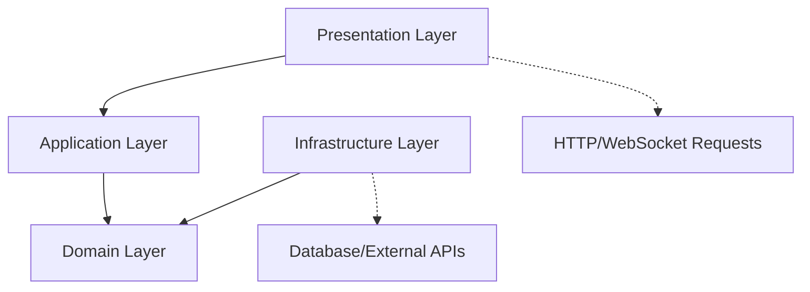
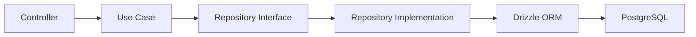
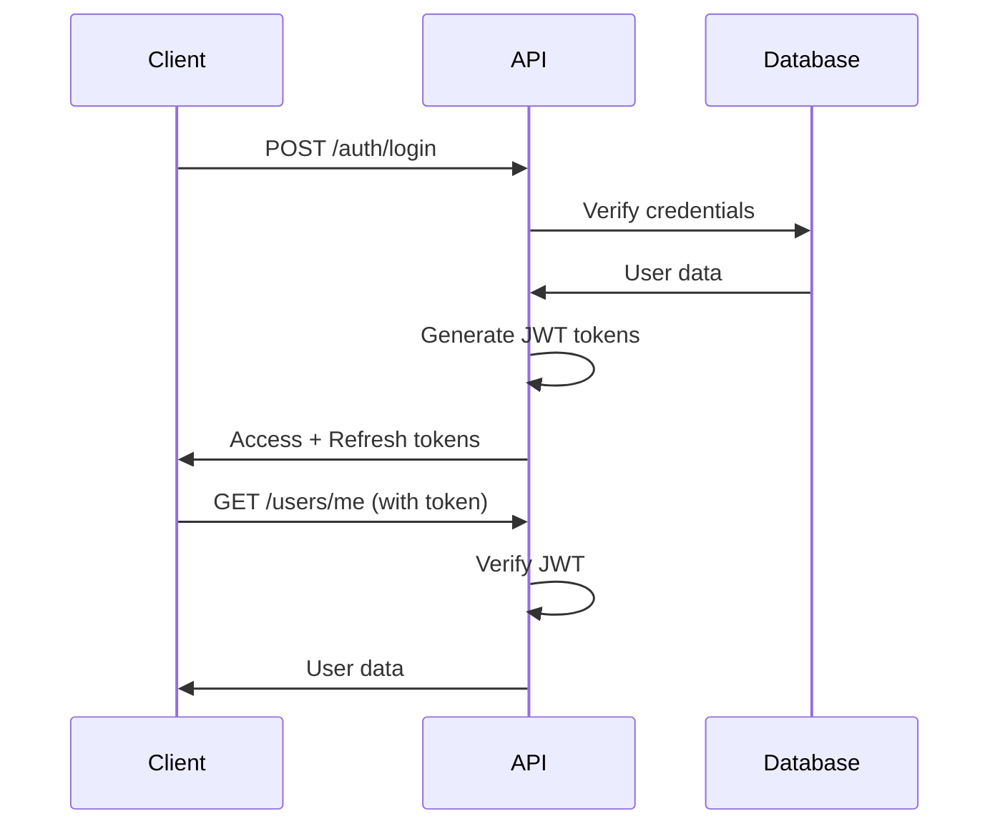
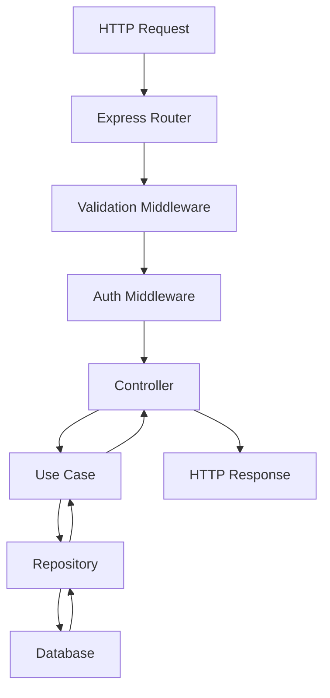
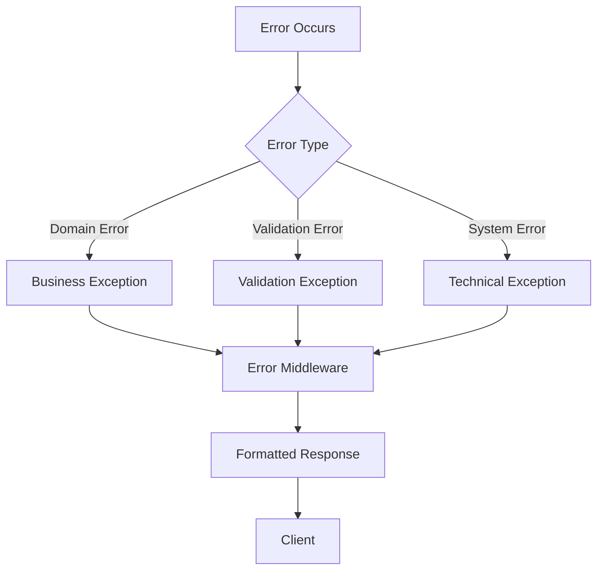
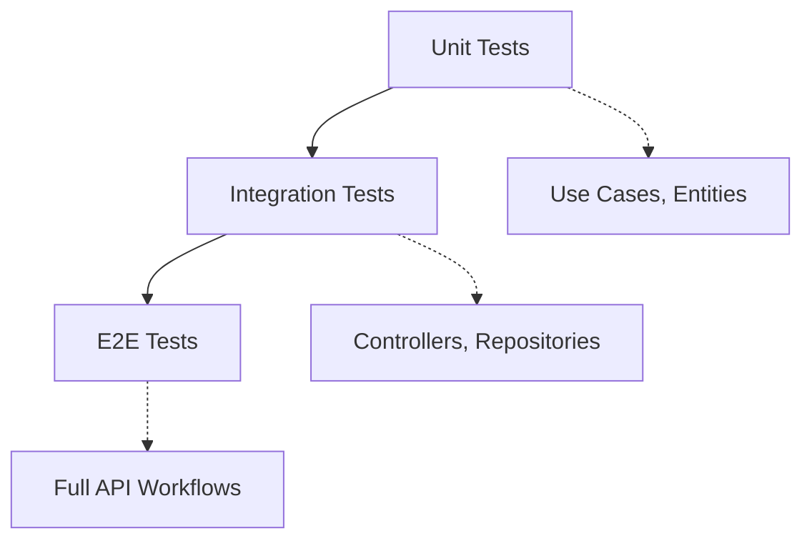

# Architecture

The Cinema API is built using **Clean Architecture** principles, creating a robust, maintainable, and testable system. This document provides a comprehensive overview of the architectural decisions, patterns, and principles that guide the development of this API.

## Architectural Goals

Our architecture is designed to achieve the following objectives:

### 1. **Maintainability**

* Clear separation of concerns
* Modular code organization
* Easy to understand and modify

### 2. **Testability**

* Dependency injection for easy mocking
* Isolated business logic
* Comprehensive test coverage

### 3. **Scalability**

* Modular design for feature additions
* Performance-optimized database queries
* Horizontal scaling capabilities

### 4. **Developer Experience**

* Type safety throughout the codebase
* Consistent patterns and conventions
* Self-documenting code structure

## 🏗️ Clean Architecture Layers

Our system follows the **Clean Architecture** pattern with four distinct layers:



### Domain Layer (Core)

**Location**: `src/modules/*/domain/`

The innermost layer containing:

* **Entities** - Core business objects
* **Interfaces** - Contracts for external dependencies
* **Business Rules** - Pure business logic
* **Domain Errors** - Business-specific exceptions

**Key Characteristics**:

* No dependencies on external frameworks
* Contains pure business logic
* Framework-agnostic
* Highly testable

```typescript
// Example: User Entity
export class User {
  constructor(
    public readonly id: string,
    public readonly email: string,
    public readonly username: string
  ) {}

  // Pure business logic
  public isAccountOlderThan(days: number): boolean {
    const threshold = new Date(Date.now() - days * 24 * 60 * 60 * 1000);
    return this.createdAt < threshold;
  }
}
```

### Application Layer (Use Cases)

**Location**: `src/modules/*/application/`

Orchestrates the flow of data and coordinates between layers:

* **Use Cases** - Application-specific business rules
* **DTOs** - Data transfer objects
* **Validators** - Input validation schemas
* **Controllers** - HTTP request handlers

**Key Characteristics**:

* Implements use cases
* Depends only on the Domain layer
* Contains application-specific logic
* Coordinates between layers

```typescript
// Example: Use Case
export class RegisterUserUseCase {
  constructor(
    private readonly userRepository: IUserRepository,
    private readonly passwordService: IPasswordService
  ) {}

  async execute(data: RegisterDTO): Promise<UserResponseDTO> {
    // Business logic orchestration
    const exists = await this.userRepository.existsByEmail(data.email);
    if (exists) throw new EmailAlreadyExistsError(data.email);
    
    const passwordHash = await this.passwordService.hash(data.password);
    const user = await this.userRepository.create({ ...data, passwordHash });
    
    return toUserResponseDTO(user);
  }
}
```

### Infrastructure Layer

**Location**: `src/modules/*/infrastructure/`

Provides concrete implementations for external concerns:

* **Repositories** - Database access implementations
* **Services** - External API integrations
* **Database Schemas** - Data persistence models
* **Configuration** - External service setup

**Key Characteristics**:

* Implements interfaces defined in Domain layer
* Handles external dependencies
* Framework-specific code
* Easily replaceable implementations

```typescript
// Example: Repository Implementation
export class UserRepository implements IUserRepository {
  async findByEmail(email: string): Promise<User | null> {
    const [row] = await db
      .select()
      .from(users)
      .where(eq(users.email, email))
      .limit(1);

    return row ? this.mapToDomain(row) : null;
  }
}
```

### Presentation Layer

**Location**: `src/modules/*/presentation/`

Handles external communication protocols:

* **Routes** - HTTP endpoint definitions
* **Middleware** - Request/response processing
* **WebSocket Handlers** - Real-time communication
* **Input Validation** - Request data validation

**Key Characteristics**:

* Protocol-specific (HTTP, WebSocket)
* Handles request/response formatting
* Applies middleware and validation
* Routes requests to appropriate use cases

```typescript
// Example: Route Definition
export function createAuthRouter(controller: AuthController): Router {
  const router = Router();

  router.post(
    '/login',
    validateRequest(loginSchema),
    controller.login
  );

  return router;
}
```

## Module Pattern

Each feature is organized as a **self-contained module** following the same structure:

```
modules/
├── users/
│   ├── domain/           # Business logic
│   ├── application/      # Use cases & DTOs
│   ├── infrastructure/   # Data access
│   ├── presentation/     # HTTP routes
│   └── users.module.ts   # Dependency injection
│
└── auth/
    ├── domain/
    ├── application/
    ├── infrastructure/
    ├── presentation/
    └── auth.module.ts
```

### Module Benefits

1. **Cohesion** - Related code stays together
2. **Encapsulation** - Clear module boundaries
3. **Reusability** - Modules can be extracted or reused
4. **Team Development** - Teams can work on different modules
5. **Testing** - Modules can be tested in isolation

### Module Interface

Each module exposes a consistent interface:

```typescript
export class UsersModule {
  // Dependency injection setup
  constructor() {
    this.setupDependencies();
  }

  // Main interface
  public getRouter(): Router {
    return this.router;
  }

  // Optional: Expose services for other modules
  public getUserRepository(): IUserRepository {
    return this.userRepository;
  }
}
```

## Dependency Injection

We use **Constructor Injection** for dependency management:

### Benefits

* **Testability** - Easy to mock dependencies
* **Flexibility** - Swap implementations easily
* **Explicitness** - Dependencies are clearly declared
* **Type Safety** - TypeScript ensures correct types

### Implementation Pattern

```typescript
// 1. Define interface in domain layer
interface IUserRepository {
  findByEmail(email: string): Promise<User | null>;
}

// 2. Implement in infrastructure layer
class UserRepository implements IUserRepository {
  async findByEmail(email: string): Promise<User | null> {
    // Implementation details
  }
}

// 3. Inject in use case
class LoginUseCase {
  constructor(
    private readonly userRepository: IUserRepository // Interface, not implementation
  ) {}
}

// 4. Wire up in module
class AuthModule {
  private userRepository = new UserRepository();
  private loginUseCase = new LoginUseCase(this.userRepository);
}
```

## Database Architecture

### Database Layer Design



### Key Components

1. **Drizzle ORM** - Type-safe database operations
2. **Repository Pattern** - Abstraction over data access
3. **Schema Definition** - Centralized table definitions
4. **Migration System** - Version-controlled schema changes

### Schema Organization

```typescript
// Each module defines its own schemas
export const users = pgTable('users', {
  id: serial('id').primaryKey(),
  email: varchar('email', { length: 255 }).notNull().unique(),
  username: varchar('username', { length: 50 }).notNull(),
  passwordHash: text('password_hash').notNull(),
  createdAt: timestamp('created_at').defaultNow().notNull(),
});

// Aggregated in database/schema.ts
export * from '../modules/users/infrastructure/database/schemas/users.schema';
export * from '../modules/auth/infrastructure/database/schemas/sessions.schema';
```

## Security Architecture

### Authentication Flow



### Security Layers

1. **Input Validation** - Zod schemas validate all inputs
2. **Authentication** - JWT tokens for user identification
3. **Authorization** - Role-based access control
4. **Password Security** - bcrypt with salt rounds
5. **Token Security** - Signed JWTs with expiration

## Request Flow

Here's how a typical request flows through the system:



### Step-by-Step Breakdown

1. **Request Arrival** - Express receives HTTP request
2. **Route Matching** - Router determines appropriate handler
3. **Middleware Processing** - Validation, authentication, etc.
4. **Controller Invocation** - HTTP-specific logic
5. **Use Case Execution** - Business logic orchestration
6. **Repository Access** - Data persistence operations
7. **Response Generation** - Format and return response

## Error Handling Strategy

### Error Flow Architecture



### Error Types

1. **Domain Errors** - Business rule violations
2. **Validation Errors** - Invalid input data
3. **Authentication Errors** - Auth failures
4. **System Errors** - Technical failures

### Error Response Format

```typescript
interface ErrorResponse {
  success: false;
  error: string;
  details?: Array<{
    field: string;
    message: string;
  }>;
  stack?: string; // Development only
}
```

## Testing Strategy

### Testing Pyramid



### Testing Levels

1. **Unit Tests** - Individual components in isolation
2. **Integration Tests** - Component interactions
3. **E2E Tests** - Complete user workflows

### Testing Benefits from Architecture

* **Domain Layer** - Pure functions, easy to test
* **Dependency Injection** - Easy mocking
* **Interface Segregation** - Focused test scenarios
* **Error Handling** - Predictable error scenarios

## Extensibility Points

The architecture provides several extension points:

### 1. New Modules

Add new features by creating new modules:

```
modules/
├── films/        # New module
├── watchparty/   # New module
└── notifications/ # New module
```

### 2. New Services

Implement new external integrations:

```typescript
interface IEmailService {
  sendWelcomeEmail(user: User): Promise<void>;
}

class SendGridEmailService implements IEmailService {
  // Implementation
}
```

### 3. New Middleware

Add cross-cutting concerns:

```typescript
export const rateLimitMiddleware = (limit: number) => {
  // Rate limiting logic
};
```

### 4. New Authentication Methods

Extend authentication options:

```typescript
export class OAuthUseCase {
  constructor(
    private readonly userRepository: IUserRepository,
    private readonly oauthService: IOAuthService
  ) {}
}
```

## Performance Considerations

### Database Optimization

* **Connection Pooling** - Reuse database connections
* **Query Optimization** - Efficient SQL generation
* **Indexing Strategy** - Optimize common queries
* **Pagination** - Handle large datasets

### Caching Strategy

* **Application Cache** - In-memory caching for frequent data
* **Database Cache** - Query result caching
* **CDN Integration** - Static asset caching

### Monitoring Points

* **Request Latency** - API response times
* **Database Performance** - Query execution times
* **Error Rates** - System health monitoring
* **Resource Usage** - CPU, memory, database connections

## Next Steps

Ready to dive deeper? Explore these sections:

1. [**Project Structure**](project-structure.md) - Detailed file organization
2. [**Module Pattern**](module-pattern.md) - Deep dive into modules
3. [**Dependency Injection**](dependency-injection.md) - DI implementation details
4. [**Database Layer**](database-layer.md) - Database architecture specifics

Or jump to practical guides:

* [**Creating a Module**](../guides/creating-module.md) - Build your first module
* [**Adding Endpoints**](../guides/adding-endpoints.md) - Extend existing functionality
* [**Writing Tests**](../guides/writing-tests.md) - Test your code effectively
