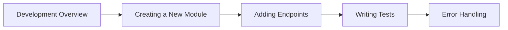
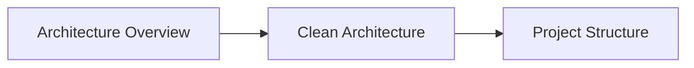

# 📖 Getting Started Overview

Use this section to get the Cinema API running locally. Then start contributing safely.

## Quick navigation

### First-time setup

1. [Quick Start](quick-start.md)
2. [Environment Setup](../../getting-started/environment-setup.md)
3. [Database Setup](../../getting-started/database-setup.md)
4. [Running the API](../../getting-started/running-the-api.md)

### Daily development

1. [Development Overview](../development-guide/)
2. [Creating a New Module](../../development-guide/creating-a-new-module.md)
3. [Adding Endpoints](../../development-guide/adding-endpoints.md)
4. [Writing Tests](../../development-guide/writing-tests.md)
5. [Error Handling](../../development-guide/error-handling.md)

## Prerequisites

You’ll be productive faster if these are done first.

### Required

* **Node.js 20+** - JavaScript runtime
* **pnpm** - Package manager (preferred over npm/yarn)
* **PostgreSQL 14+** - Database server
* **Git** - Version control

### Recommended

* **VS Code** - Code editor with TypeScript support
* **Postman** or **Insomnia** - API testing
* **TablePlus** or **pgAdmin** - Database management
* **Docker** (optional) - For containerized PostgreSQL

### Helpful background

* **TypeScript** - Primary language
* **Express.js** - Web framework
* **PostgreSQL** - Database fundamentals
* **REST APIs** - HTTP methods, status codes
* **JWT** - Authentication concepts

## Learning paths

### New to the project


**Estimated time**: 2-3 hours

### Ready to contribute



**Estimated time**: 4-6 hours

### Architecture deep dive



**Estimated time**: 6-8 hours

## Development workflow

Use this when you’re iterating on features.

### Feature development

```bash
# 1) Create a branch
git checkout -b feature/my-change

# 2) Start API (pick one)
pnpm dev:api
# or: cd apps/api && pnpm dev

# 3) Validate quickly
pnpm test
pnpm lint
pnpm type-check
```

### Database changes

```bash
# Generate migration
pnpm db:generate

# Apply migration
pnpm db:migrate

# Optional: seed data
pnpm db:seed
```

### Testing

```bash
pnpm test

# If available in the repo:
pnpm test:integration
pnpm test:e2e
pnpm test:coverage
```

## Common tasks

### Adding a New Endpoint

1. Define route in `presentation/routes/`
2. Create controller method
3. Implement use case (if needed)
4. Add validation schema
5. Write tests
6. Update documentation

### Creating a New Module

1. Set up directory structure
2. Define domain entities and interfaces
3. Implement use cases
4. Create infrastructure layer
5. Set up presentation layer
6. Configure dependency injection

### Database Schema Changes

1. Modify schema files
2. Generate migration
3. Apply migration
4. Update seed data (if needed)
5. Update tests

## Troubleshooting

### Common Issues

**Port Already in Use**

macOS/Linux:

```bash
lsof -ti:3000 | xargs kill -9
```

Windows (PowerShell):

```powershell
Get-Process -Id (Get-NetTCPConnection -LocalPort 3000).OwningProcess | Stop-Process -Force
```

**Database Connection Failed**

```bash
# Basic health check
pg_isready

# Nuclear option
pnpm db:reset
```

**TypeScript Errors**

```bash
# Clean build
pnpm clean && pnpm build

# Check types
pnpm type-check
```

**Dependency Issues**

```bash
# Clean install
rm -rf node_modules pnpm-lock.yaml
pnpm install
```

## Getting help

### Docs

* [Architecture Overview](../../developer-guide/architecture/api-architecture/architecture.md)
* [API Reference Overview](../reference/)
* [Examples Overview](/broken/spaces/WVeeb6Vu2ZyJx2jJFLo6/pages/SKW7YUUEqmIti47kic96)
* [FAQ](../../faq.md)

### Project links

* Repo: [https://github.com/mathieusouflis/HETIC-projet-cinema](https://github.com/mathieusouflis/HETIC-projet-cinema)
* Issues: [https://github.com/mathieusouflis/HETIC-projet-cinema/issues](https://github.com/mathieusouflis/HETIC-projet-cinema/issues)

### Ready to start?

1. [Quick Start](quick-start.md)
2. [Database Setup](../../getting-started/database-setup.md)
3. [Running the API](../../getting-started/running-the-api.md)
