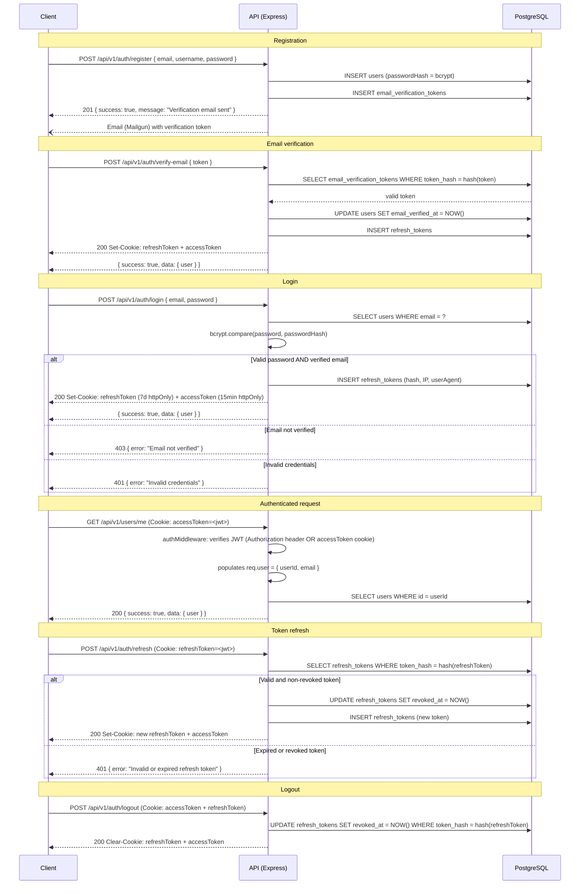
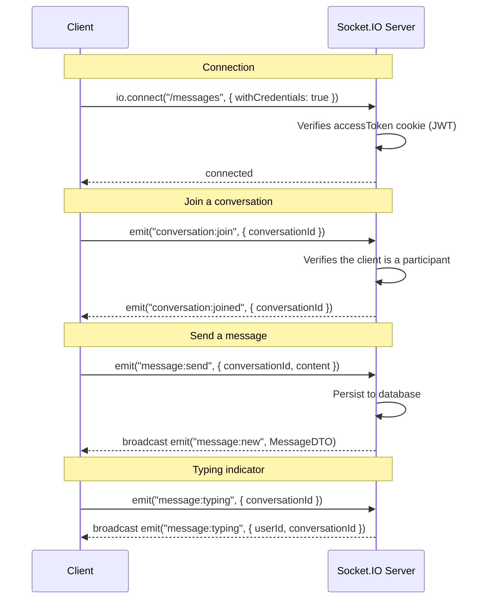

# REST API — Documentation

**Framework:** Express 5
**Runtime:** Node.js (tsx in dev, tsup for build)
**Default port:** 3000 (variable `BACKEND_PORT`)
**Base URL:** `http://localhost:3000/api/v1`
**Versioning:** `/api/v1` prefix in the URL

---

## Table of Contents

1. [Overview](#overview)
2. [JWT Authentication](#jwt-authentication)
3. [Response Format](#response-format)
4. [Error Handling](#error-handling)
5. [Endpoints by Module](#endpoints-by-module)
   - [Authentication](#authentication)
   - [Users](#users)
   - [Contents](#contents)
   - [Movies](#movies)
   - [Series](#series)
   - [Categories](#categories)
   - [Peoples](#peoples)
   - [Watchlist](#watchlist)
   - [Watchparty](#watchparty)
   - [Conversations](#conversations)
   - [Messages](#messages)
   - [Friendships](#friendships)
6. [WebSocket (Socket.IO)](#websocket-socketio)
7. [Rate Limiting](#rate-limiting)
8. [Interactive Documentation](#interactive-documentation)

---

## Overview

The API follows Clean Architecture (Domain / Application / Infrastructure). Routes are automatically generated via TypeScript decorators (`@Controller`, `@Get`, `@Post`, etc.) applied to controllers. Request validation is handled by Zod via `@ValidateBody`, `@ValidateQuery`, `@ValidateParams` decorators.

### System Endpoints

| Method | Route | Description |
|--------|-------|-------------|
| GET | `/status` | Health check |
| GET | `/api/v1/` | List of registered modules |
| GET | `/api/v1/docs` | Swagger UI (interactive interface) |
| GET | `/api/v1/openapi.json` | OpenAPI 3.0 specification |
| GET | `/docs/asyncapi.json` | AsyncAPI specification (WebSocket) |

### Middleware Execution Order

1. Rate limiter (global)
2. Morgan (HTTP logging)
3. Body parser (JSON + URL-encoded)
4. CORS (origin: `FRONTEND_URL`)
5. Cookie parser
6. Module routes
7. AsyncAPI docs
8. Sentry error handler (production only)
9. Not Found handler + global Error handler

---

## JWT Authentication

### Dual-token Strategy

The system uses two distinct JWT tokens:

| Token | Lifetime | Transport |
|-------|----------|-----------|
| Access token | 15 minutes | httpOnly `accessToken` cookie + `Authorization: Bearer` header |
| Refresh token | 7 days | httpOnly `refreshToken` cookie |

Cookies are configured with:
- `httpOnly: true` (inaccessible from JavaScript)
- `sameSite: "lax"`
- `secure: true` in production only
- `domain` from the `COOKIE_DOMAIN` variable

### Complete Authentication Flow



### Token Verification in Requests

The `authMiddleware` accepts the token from two sources, in this order:
1. HTTP header: `Authorization: Bearer <token>`
2. httpOnly cookie: `accessToken`

---

## Response Format

### Success

```json
{
  "success": true,
  "message": "Optional description",
  "data": { ... }
}
```

For paginated lists:

```json
{
  "success": true,
  "data": {
    "items": [...],
    "total": 100,
    "page": 1,
    "limit": 20,
    "totalPages": 5
  }
}
```

For messages (cursor pagination):

```json
{
  "success": true,
  "data": {
    "items": [...],
    "nextCursor": "uuid",
    "hasMore": true
  }
}
```

### Empty response (deletion)

Deletion endpoints return `204 No Content` with no body.

---

## Error Handling

### Standard Error Format

```json
{
  "success": false,
  "error": {
    "code": "UNAUTHORIZED",
    "message": "Error description",
    "details": { ... }
  }
}
```

### HTTP Codes Used

| Code | Class | When |
|------|--------|-------|
| 200 | Success | Successful read or update |
| 201 | Created | Successful creation |
| 204 | No Content | Successful deletion |
| 400 | Bad Request | Invalid request data (Zod) |
| 401 | Unauthorized | Missing, invalid, or expired token |
| 403 | Forbidden | Authenticated but not authorized (e.g. editing another profile, unverified email) |
| 404 | Not Found | Non-existent resource |
| 409 | Conflict | Duplicate (email, username, existing friendship) |
| 429 | Too Many Requests | Rate limiting triggered |
| 500 | Server Error | Unhandled internal error |

### Error Hierarchy

| Class | HTTP Code | `errorCode` |
|--------|-----------|-------------|
| `AppError` | base | — |
| `UnauthorizedError` | 401 | `UNAUTHORIZED` |
| `ForbiddenError` | 403 | `FORBIDDEN` |
| `NotFoundError` | 404 | `NOT_FOUND` |
| `ValidationError` | 400 | `VALIDATION_ERROR` |
| `ConflictError` | 409 | `CONFLICT` |
| `ServerError` | 500 | `SERVER_ERROR` |

---

## Endpoints by Module

### Authentication

Prefix: `/api/v1/auth`

| Method | Route | Description | Auth required |
|--------|-------|-------------|:---:|
| POST | `/register` | Create an account (sends a verification email) | No |
| POST | `/login` | Email/password login | No |
| POST | `/logout` | Logout (clears cookies) | Yes |
| POST | `/refresh` | Renew access token + refresh token | No (refreshToken cookie) |
| GET | `/me` | Minimal profile from JWT | Yes |
| POST | `/forgot-password` | Request reset (always returns 200) | No |
| POST | `/reset-password` | Reset with email token | No |
| POST | `/verify-email` | Email verification with token | No |
| POST | `/resend-verification` | Resend verification email (always returns 200) | No |

---

### Users

Prefix: `/api/v1/users`

| Method | Route | Description | Auth required |
|--------|-------|-------------|:---:|
| GET | `/me` | Full profile of the logged-in user | Yes |
| PATCH | `/me` | Update own profile | Yes |
| DELETE | `/me` | Delete own account | Yes |
| GET | `/` | Paginated list of users | Yes |
| GET | `/:id` | User profile by ID | No |
| PATCH | `/:id` | Update a profile (own or admin) | Yes |
| DELETE | `/:id` | Delete an account (own or admin) | Yes |

---

### Contents

Prefix: `/api/v1/contents`

Unified movies + series interface.

| Method | Route | Description | Auth required |
|--------|-------|-------------|:---:|
| GET | `/` | Paginated list of content (movies and series) with filters | No |
| GET | `/:id` | Content detail by ID (query params: `withCast`, `withCategory`, `withPlatform`, `withSeasons`, `withEpisodes`) | No |

---

### Movies

Prefix: `/api/v1/movies`

| Method | Route | Description | Auth required |
|--------|-------|-------------|:---:|
| GET | `/` | Paginated list of movies with filters | No |
| GET | `/:id` | Movie detail by ID (query param: `withCategories`) | No |

---

### Series

Prefix: `/api/v1/series`

| Method | Route | Description | Auth required |
|--------|-------|-------------|:---:|
| GET | `/` | Paginated list of series with filters | No |
| GET | `/:id` | Series detail by ID (query param: `withCategories`) | No |

---

### Categories

Prefix: `/api/v1/categories`

| Method | Route | Description | Auth required |
|--------|-------|-------------|:---:|
| GET | `/` | Paginated list of categories/genres | No |
| GET | `/:id` | Category detail by ID | No |

> Note: Routes for creating, updating, and deleting categories are defined in the controller but commented out (not exposed in production).

---

### Peoples

Prefix: `/api/v1/peoples`

| Method | Route | Description | Auth required |
|--------|-------|-------------|:---:|
| GET | `/` | Paginated list of people (actors, directors) | No |
| GET | `/search` | Search on TMDB with local synchronization | No |
| GET | `/:id` | Person detail by ID | No |
| POST | `/` | Create a person | Yes |
| PATCH | `/:id` | Update a person | Yes |
| DELETE | `/:id` | Delete a person | Yes |

---

### Watchlist

Prefix: `/api/v1/watchlist`

| Method | Route | Description | Auth required |
|--------|-------|-------------|:---:|
| GET | `/` | Paginated list of the logged-in user's watchlist entries | Yes |
| POST | `/` | Add content to the watchlist | Yes |
| GET | `/:id` | Watchlist entry detail by ID | Yes |
| GET | `/content/:id` | Watchlist entry for a given content | Yes |
| PATCH | `/:id` | Update the status/progress of a watchlist entry | Yes |
| PUT | `/content/:id` | Create or update the entry for a content | Yes |
| DELETE | `/:id` | Delete a watchlist entry by ID | Yes |
| DELETE | `/content/:id` | Delete the watchlist entry for a content | Yes |

**Status values (`watchlistStatus`)**: `plan_to_watch`, `watching`, `completed`, `dropped`, `undecided`, `not_interested`

---

### Watchparty

Prefix: `/api/v1/watchparty`

| Method | Route | Description | Auth required |
|--------|-------|-------------|:---:|
| GET | `/` | Paginated list of watchparties with filters | Yes |
| POST | `/` | Create a watchparty | Yes |
| GET | `/:id` | Watchparty detail by ID | Yes |
| PATCH | `/:id` | Update a watchparty | Yes |
| DELETE | `/:id` | Delete a watchparty | Yes |

---

### Conversations

Prefix: `/api/v1/conversations`

| Method | Route | Description | Auth required |
|--------|-------|-------------|:---:|
| GET | `/` | List of the logged-in user's conversations (with unread count and last message) | Yes |
| POST | `/` | Create or retrieve a DM conversation with a friend | Yes |
| GET | `/:id` | Conversation detail | Yes |
| POST | `/:id/read` | Mark a conversation as read | Yes |

---

### Messages

Prefix: `/api/v1/messages`

| Method | Route | Description | Auth required |
|--------|-------|-------------|:---:|
| GET | `/conversations/:conversationId` | Paginated messages in a conversation (cursor pagination) | Yes |
| POST | `/conversations/:conversationId` | Send a message in a conversation | Yes |
| PATCH | `/:messageId` | Edit message content (author only) | Yes |
| DELETE | `/:messageId` | Delete a message (soft delete, author only) | Yes |

---

### Friendships

Prefix: `/api/v1/friendships`

| Method | Route | Description | Auth required |
|--------|-------|-------------|:---:|
| GET | `/` | List of the user's relationships (filterable by `status`) | Yes |
| POST | `/:userId` | Send a friend request | Yes |
| PATCH | `/:id` | Accept or decline a friend request (recipient only) | Yes |
| DELETE | `/:id` | Delete a friendship or cancel a request | Yes |

**Status values (`friendship_status`)**: `pending`, `accepted`, `rejected`

---

## WebSocket (Socket.IO)

Active namespace: `/messages`
Path: `/socket.io`
Supported transports: `websocket`, `polling`

### WebSocket Authentication
The token is transmitted via the `accessToken` httpOnly cookie during the initial HTTP handshake.

### Real-time Flow Diagram



### Server → Client Events

| Event | Payload | Description |
|-----------|---------|-------------|
| `message:new` | `MessageDTO` | New message in a conversation |
| `message:typing` | `{ userId, conversationId }` | Typing indicator |
| `conversation:joined` | `{ conversationId }` | Subscription confirmation for a conversation |

### Client → Server Events

| Event | Payload | Description |
|-----------|---------|-------------|
| `conversation:join` | `{ conversationId }` | Subscribe to a conversation's messages |
| `message:send` | `{ conversationId, content }` | Send a message |
| `message:typing` | `{ conversationId }` | Signal ongoing typing |

> The full AsyncAPI specification is available at `GET /docs/asyncapi.json`.

---

## Rate Limiting

Rate limiting is applied globally via `express-rate-limit` (file `config/rate-limiter.ts`). The precise parameters (time window, maximum number of requests) are not documented in the available exploration notes — refer directly to `apps/api/src/config/rate-limiter.ts` for exact values.

When exceeded, the response is:
- HTTP code: `429 Too Many Requests`
- Header: `Retry-After` (delay before retrying)

---

## Interactive Documentation

The API exposes Swagger UI documentation auto-generated from Zod/OpenAPI decorators:

- **Swagger UI**: `GET /api/v1/docs`
- **OpenAPI JSON**: `GET /api/v1/openapi.json`
- **AsyncAPI JSON**: `GET /docs/asyncapi.json`

The OpenAPI specification is generated at application startup via `@asteasolutions/zod-to-openapi` from controller Zod schemas. There is no static versioned `openapi.json` file — the spec is always up to date with the code.
