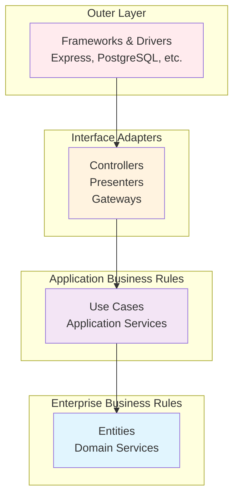

# Clean Architecture Principles

Clean Architecture is a software design philosophy that creates systems which are independent of frameworks, databases, and external interfaces. This document explains how these principles are applied in the Cinema API.

## 🎯 What is Clean Architecture?

Clean Architecture, introduced by Robert C. Martin (Uncle Bob), is an architectural pattern that emphasizes:

- **Independence** from frameworks, databases, and external agencies
- **Testability** through dependency inversion
- **Maintainability** via clear separation of concerns
- **Flexibility** to adapt to changing requirements

## 🏛️ The Dependency Rule

The overriding rule that makes Clean Architecture work is the **Dependency Rule**:

> **Source code dependencies can only point inwards. Nothing in an inner circle can know anything at all about something in an outer circle.**



## 🧅 Layer Breakdown in Cinema API

### 1. Enterprise Business Rules (Domain Layer)
**Location**: `src/modules/*/domain/`

The heart of the application containing:

#### Entities
Pure business objects with no external dependencies:

```typescript
export class User {
  constructor(
    public readonly id: string,
    public readonly email: string,
    public readonly username: string,
    private readonly passwordHash: string,
    public readonly createdAt: Date
  ) {}

  // Pure business logic - no external dependencies
  public isEmailValid(): boolean {
    const emailRegex = /^[^\s@]+@[^\s@]+\.[^\s@]+$/;
    return emailRegex.test(this.email);
  }

  public canPerformAction(requiredAccountAge: number): boolean {
    const accountAge = Date.now() - this.createdAt.getTime();
    const requiredAge = requiredAccountAge * 24 * 60 * 60 * 1000; // days to ms
    return accountAge >= requiredAge;
  }

  // Business rule: Username validation
  public static isValidUsername(username: string): boolean {
    return /^[a-zA-Z0-9_-]{3,30}$/.test(username);
  }
}
```

#### Domain Interfaces
Contracts that define how external dependencies should behave:

```typescript
export interface IUserRepository {
  findById(id: string): Promise<User | null>;
  findByEmail(email: string): Promise<User | null>;
  create(data: CreateUserProps): Promise<User>;
  update(id: string, data: UpdateUserProps): Promise<User>;
  delete(id: string): Promise<void>;
}
```

#### Domain Errors
Business-specific exceptions:

```typescript
export class EmailAlreadyExistsError extends ConflictError {
  constructor(email: string) {
    super(`A user with email "${email}" already exists`);
  }
}
```

**Key Principles:**
- ✅ No imports from outer layers
- ✅ Framework-agnostic code
- ✅ Pure business logic only
- ✅ Highly testable

### 2. Application Business Rules (Use Cases Layer)
**Location**: `src/modules/*/application/`

Orchestrates the flow of data between entities and external interfaces:

#### Use Cases
Application-specific business rules:

```typescript
export class RegisterUserUseCase {
  constructor(
    private readonly userRepository: IUserRepository, // Interface, not implementation
    private readonly passwordService: IPasswordService,
    private readonly tokenService: ITokenService
  ) {}

  async execute(data: RegisterDTO): Promise<AuthResponseDTO> {
    // 1. Validate business rules using domain entities
    if (!User.isValidUsername(data.username)) {
      throw new ValidationError('Invalid username format');
    }

    // 2. Check business constraints
    const emailExists = await this.userRepository.existsByEmail(data.email);
    if (emailExists) {
      throw new EmailAlreadyExistsError(data.email);
    }

    // 3. Apply business logic
    const passwordHash = await this.passwordService.hash(data.password);
    
    // 4. Create domain entity
    const user = await this.userRepository.create({
      email: data.email,
      username: data.username,
      passwordHash,
    });

    // 5. Generate tokens using domain data
    const { accessToken, refreshToken } = this.tokenService.generateTokenPair(
      user.id,
      user.email
    );

    // 6. Return application-specific response
    return {
      user: toUserResponseDTO(user),
      tokens: { accessToken, refreshToken }
    };
  }
}
```

#### DTOs (Data Transfer Objects)
Define the shape of data crossing layer boundaries:

```typescript
export interface RegisterDTO {
  email: string;
  username: string;
  password: string;
}

export interface AuthResponseDTO {
  user: UserResponseDTO;
  tokens: {
    accessToken: string;
    refreshToken: string;
  };
}
```

**Key Principles:**
- ✅ Depends only on Domain layer
- ✅ Contains application-specific logic
- ✅ Orchestrates between entities and external services
- ✅ No knowledge of UI or database details

### 3. Interface Adapters (Controllers & Gateways)
**Location**: `src/modules/*/presentation/` and `src/modules/*/infrastructure/`

Converts data between use cases and external interfaces:

#### Controllers (Presentation)
Convert HTTP requests to use case calls:

```typescript
export class AuthController {
  constructor(
    private readonly registerUseCase: RegisterUseCase // Use case, not direct repository
  ) {}

  register = asyncHandler(async (req: Request, res: Response): Promise<void> => {
    // Convert HTTP request to DTO
    const registerData: RegisterDTO = {
      email: req.body.email,
      username: req.body.username,
      password: req.body.password,
    };

    // Execute use case
    const result = await this.registerUseCase.execute(registerData);

    // Convert to HTTP response
    res.status(201).json({
      success: true,
      message: 'User registered successfully',
      data: result,
    });
  });
}
```

#### Repositories (Infrastructure)
Implement domain interfaces using external frameworks:

```typescript
export class UserRepository implements IUserRepository {
  // Implements interface defined in domain layer
  async findByEmail(email: string): Promise<User | null> {
    // Uses external framework (Drizzle ORM)
    const [row] = await db
      .select()
      .from(users)
      .where(eq(users.email, email))
      .limit(1);

    // Converts database row to domain entity
    return row ? this.mapToDomain(row) : null;
  }

  // Maps database representation to domain entity
  private mapToDomain(row: UserRow): User {
    return new User(
      row.id.toString(),
      row.email,
      row.username,
      row.passwordHash,
      row.createdAt
    );
  }
}
```

**Key Principles:**
- ✅ Implements interfaces defined in inner layers
- ✅ Converts between different data formats
- ✅ Contains framework-specific code
- ✅ Can be easily replaced or modified

### 4. Frameworks & Drivers (External Layer)
**Location**: Framework configurations and external services

The outermost layer containing:
- Web frameworks (Express.js)
- Databases (PostgreSQL)
- External APIs
- Device drivers
- Configuration

## 🔄 Dependency Inversion in Action

Here's how dependency inversion works in practice:

### Traditional Approach (❌ Bad)
```typescript
class LoginUseCase {
  private userRepository = new PostgreSQLUserRepository(); // Direct dependency
  
  async execute(credentials: LoginDTO) {
    // Tightly coupled to PostgreSQL implementation
    const user = await this.userRepository.findByEmail(credentials.email);
    // ...
  }
}
```

### Clean Architecture Approach (✅ Good)
```typescript
// 1. Define interface in domain layer
interface IUserRepository {
  findByEmail(email: string): Promise<User | null>;
}

// 2. Use case depends on interface, not implementation
class LoginUseCase {
  constructor(
    private readonly userRepository: IUserRepository // Interface dependency
  ) {}
  
  async execute(credentials: LoginDTO) {
    const user = await this.userRepository.findByEmail(credentials.email);
    // ...
  }
}

// 3. Implement interface in infrastructure layer
class PostgreSQLUserRepository implements IUserRepository {
  async findByEmail(email: string): Promise<User | null> {
    // PostgreSQL-specific implementation
  }
}

// 4. Wire dependencies in module
class AuthModule {
  private userRepository = new PostgreSQLUserRepository();
  private loginUseCase = new LoginUseCase(this.userRepository);
}
```

## 🧪 Testing Benefits

Clean Architecture makes testing dramatically easier:

### Unit Testing Use Cases
```typescript
describe('RegisterUserUseCase', () => {
  let useCase: RegisterUserUseCase;
  let mockUserRepository: jest.Mocked<IUserRepository>;
  let mockPasswordService: jest.Mocked<IPasswordService>;

  beforeEach(() => {
    // Easy to mock interfaces
    mockUserRepository = {
      existsByEmail: jest.fn(),
      create: jest.fn(),
    } as any;

    mockPasswordService = {
      hash: jest.fn().mockResolvedValue('hashed-password'),
    } as any;

    // Inject mocks
    useCase = new RegisterUserUseCase(
      mockUserRepository,
      mockPasswordService
    );
  });

  it('should register a new user successfully', async () => {
    // Arrange
    mockUserRepository.existsByEmail.mockResolvedValue(false);
    mockUserRepository.create.mockResolvedValue(mockUser);

    // Act
    const result = await useCase.execute({
      email: 'test@example.com',
      username: 'testuser',
      password: 'password123'
    });

    // Assert
    expect(result.user.email).toBe('test@example.com');
    expect(mockPasswordService.hash).toHaveBeenCalledWith('password123');
  });
});
```

### Integration Testing Controllers
```typescript
describe('AuthController', () => {
  let app: Express;
  
  beforeEach(() => {
    // Test with real implementations but test database
    app = createTestApp();
  });

  it('should register a user via HTTP', async () => {
    const response = await request(app)
      .post('/api/v1/auth/register')
      .send({
        email: 'test@example.com',
        username: 'testuser',
        password: 'Password123'
      });

    expect(response.status).toBe(201);
    expect(response.body.success).toBe(true);
  });
});
```

## 🔧 Implementation Patterns

### 1. Repository Pattern
Abstracts data access logic:

```typescript
// Domain interface
interface IUserRepository {
  findById(id: string): Promise<User | null>;
}

// Infrastructure implementation
class DrizzleUserRepository implements IUserRepository {
  async findById(id: string): Promise<User | null> {
    // Drizzle-specific implementation
  }
}

// Could easily swap for different implementation
class MongoUserRepository implements IUserRepository {
  async findById(id: string): Promise<User | null> {
    // MongoDB-specific implementation
  }
}
```

### 2. Service Pattern
Encapsulates complex operations:

```typescript
// Domain interface
interface IPasswordService {
  hash(password: string): Promise<string>;
  compare(password: string, hash: string): Promise<boolean>;
}

// Infrastructure implementation
class BcryptPasswordService implements IPasswordService {
  async hash(password: string): Promise<string> {
    return bcrypt.hash(password, 10);
  }

  async compare(password: string, hash: string): Promise<boolean> {
    return bcrypt.compare(password, hash);
  }
}
```

### 3. Factory Pattern
Creates and configures objects:

```typescript
export class AuthModuleFactory {
  static create(): AuthModule {
    // Create infrastructure dependencies
    const userRepository = new DrizzleUserRepository();
    const passwordService = new BcryptPasswordService();
    const tokenService = new JWTService();

    // Create use cases with dependencies
    const registerUseCase = new RegisterUseCase(
      userRepository,
      passwordService,
      tokenService
    );

    // Create controller
    const controller = new AuthController(registerUseCase);

    return new AuthModule(controller);
  }
}
```

## 📊 Benefits Realized

### 1. Framework Independence
- Can swap Express for Fastify without changing business logic
- Database changes don't affect use cases
- External API changes are isolated

### 2. Testability
- Unit test business logic in isolation
- Mock external dependencies easily
- Test different scenarios comprehensively

### 3. Maintainability
- Clear separation of concerns
- Easy to locate and modify specific functionality
- Reduced coupling between components

### 4. Team Development
- Different teams can work on different layers
- Clear interfaces define contracts between teams
- Parallel development possible

## 🚨 Common Pitfalls

### 1. Leaky Abstractions
**❌ Bad:**
```typescript
interface IUserRepository {
  findByEmail(email: string): Promise<DrizzleUser>; // Exposing framework type
}
```

**✅ Good:**
```typescript
interface IUserRepository {
  findByEmail(email: string): Promise<User>; // Domain type
}
```

### 2. Anemic Domain Models
**❌ Bad:**
```typescript
export interface User {
  id: string;
  email: string;
  // No behavior, just data
}
```

**✅ Good:**
```typescript
export class User {
  constructor(public readonly id: string, public readonly email: string) {}
  
  // Rich behavior
  isEmailValid(): boolean {
    return /^[^\s@]+@[^\s@]+\.[^\s@]+$/.test(this.email);
  }
}
```

### 3. Breaking the Dependency Rule
**❌ Bad:**
```typescript
// In domain layer
import { Request } from 'express'; // Violates dependency rule

export class User {
  constructor(private req: Request) {} // Framework dependency in domain
}
```

**✅ Good:**
```typescript
// Domain layer stays pure
export class User {
  constructor(private email: string) {} // No external dependencies
}
```

## 🎯 Summary

Clean Architecture in the Cinema API provides:

1. **Clear Boundaries** - Each layer has specific responsibilities
2. **Dependency Inversion** - Inner layers define contracts for outer layers
3. **Framework Independence** - Business logic isn't tied to specific frameworks
4. **Testability** - Easy to test each layer in isolation
5. **Maintainability** - Changes in one layer don't affect others

The investment in this architectural approach pays dividends in:
- Reduced bugs through better testing
- Faster development through clear patterns
- Easier onboarding for new team members
- Greater flexibility to adapt to changing requirements

## 🔗 Related Documentation

- **[Project Structure](project-structure.md)** - How files are organized
- **[Module Pattern](module-pattern.md)** - Module-specific architecture
- **[Dependency Injection](dependency-injection.md)** - DI implementation details
- **[Creating a Module](../guides/creating-module.md)** - Practical application