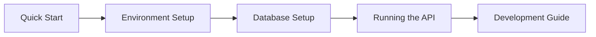
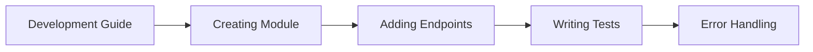
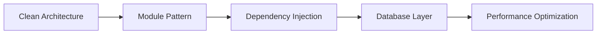

# Getting Started Guides

Welcome to the Cinema API development guides! This section provides comprehensive, step-by-step instructions for getting up and running with the API, whether you're setting up for the first time or adding new features.

## 🚀 Quick Navigation

### For New Developers
Start here if you're new to the project:

1. **[Quick Start](quick-start.md)** - Get the API running in 5 minutes
2. **[Environment Setup](environment-setup.md)** - Complete development environment configuration
3. **[Database Setup](database-setup.md)** - PostgreSQL and migration setup
4. **[Running the API](running-the-api.md)** - Development and production deployment

### For Active Development
Continue here once you have the basics working:

1. **[Development Guide](development-guide.md)** - Daily development workflow
2. **[Creating a New Module](creating-module.md)** - Add new features following Clean Architecture
3. **[Adding Endpoints](adding-endpoints.md)** - Extend existing modules with new API endpoints
4. **[Writing Tests](writing-tests.md)** - Comprehensive testing strategies
5. **[Error Handling](error-handling.md)** - Implement robust error handling

## 📋 Prerequisites

Before you begin, ensure you have:

### Required Software
- **Node.js 20+** - JavaScript runtime
- **pnpm** - Package manager (preferred over npm/yarn)
- **PostgreSQL 14+** - Database server
- **Git** - Version control

### Recommended Tools
- **VS Code** - Code editor with TypeScript support
- **Postman** or **Insomnia** - API testing
- **TablePlus** or **pgAdmin** - Database management
- **Docker** (optional) - For containerized PostgreSQL

### Knowledge Prerequisites
- **TypeScript** - Primary language
- **Express.js** - Web framework
- **PostgreSQL** - Database fundamentals
- **REST APIs** - HTTP methods, status codes
- **JWT** - Authentication concepts

## 🎯 Learning Path

### Beginner Track (New to the Project)


**Estimated time**: 2-3 hours

### Intermediate Track (Ready to Contribute)


**Estimated time**: 4-6 hours

### Advanced Track (Architecture Deep Dive)


**Estimated time**: 6-8 hours

## 🛠️ Development Workflow

Once you're set up, here's the typical development workflow:

### 1. Feature Development
```bash
# Create feature branch
git checkout -b feature/new-feature

# Start development server
pnpm dev

# Make changes and test
# ...

# Run tests
pnpm test

# Lint and type check
pnpm lint && pnpm type-check
```

### 2. Database Changes
```bash
# Create migration
pnpm db:generate

# Apply migration
pnpm db:migrate

# (Optional) Seed data
pnpm db:seed
```

### 3. Testing
```bash
# Unit tests
pnpm test

# Integration tests
pnpm test:integration

# E2E tests
pnpm test:e2e

# Coverage report
pnpm test:coverage
```

## 📚 Guide Contents Overview

### [Quick Start](quick-start.md)
Get the API running with minimal setup:
- Clone and install dependencies
- Basic configuration
- Start development server
- Test with sample requests

### [Environment Setup](environment-setup.md)
Complete development environment:
- Node.js and pnpm installation
- IDE configuration and extensions
- Development tools setup
- Environment variables configuration

### [Database Setup](database-setup.md)
PostgreSQL and ORM configuration:
- PostgreSQL installation and setup
- Database creation and user configuration
- Migration system overview
- Seed data management

### [Running the API](running-the-api.md)
Deployment and runtime configuration:
- Development mode
- Production deployment
- Docker containerization
- Environment-specific configurations

### [Development Guide](development-guide.md)
Daily development practices:
- Code organization principles
- Git workflow and branching
- Debugging techniques
- Performance monitoring

### [Creating a Module](creating-module.md)
Step-by-step module creation:
- Clean Architecture implementation
- Domain, application, and infrastructure layers
- Dependency injection setup
- Testing strategy

### [Adding Endpoints](adding-endpoints.md)
Extend existing modules:
- Route definition and middleware
- Controller implementation
- Validation and error handling
- Documentation and testing

### [Writing Tests](writing-tests.md)
Comprehensive testing approaches:
- Unit testing with Vitest
- Integration testing strategies
- Mocking dependencies
- Test data management

### [Error Handling](error-handling.md)
Robust error management:
- Custom error classes
- Global error middleware
- Client-friendly error responses
- Logging and monitoring

## 🎯 Common Development Tasks

### Adding a New Endpoint
1. Define route in `presentation/routes/`
2. Create controller method
3. Implement use case (if needed)
4. Add validation schema
5. Write tests
6. Update documentation

### Creating a New Module
1. Set up directory structure
2. Define domain entities and interfaces
3. Implement use cases
4. Create infrastructure layer
5. Set up presentation layer
6. Configure dependency injection

### Database Schema Changes
1. Modify schema files
2. Generate migration
3. Apply migration
4. Update seed data (if needed)
5. Update tests

## 🔍 Troubleshooting

### Common Issues

**Port Already in Use**
```bash
# Find and kill process using port 3000
lsof -ti:3000 | xargs kill -9
```

**Database Connection Failed**
```bash
# Check PostgreSQL is running
pg_ctl status

# Reset database
pnpm db:reset
```

**TypeScript Errors**
```bash
# Clean build
pnpm clean && pnpm build

# Check types
pnpm type-check
```

**Dependency Issues**
```bash
# Clean install
rm -rf node_modules pnpm-lock.yaml
pnpm install
```

## 📞 Getting Help

### Documentation Resources
- **[Architecture Overview](../architecture/README.md)** - System design
- **[API Reference](../reference/README.md)** - Endpoint documentation
- **[Examples](../examples/README.md)** - Code samples

### Development Support
- **Issues** - Report bugs or request features
- **Discussions** - Ask questions and share ideas
- **Code Reviews** - Get feedback on pull requests

### Quick Links
- [Project Repository](https://github.com/your-org/cinema-api)
- [API Documentation](../reference/README.md)
- [Architecture Docs](../architecture/README.md)
- [Testing Guide](writing-tests.md)

## 🎉 Ready to Start?

Choose your starting point:

- **New to the project?** → Start with [Quick Start](quick-start.md)
- **Ready to develop?** → Jump to [Development Guide](development-guide.md)
- **Want to understand the architecture?** → Read [Architecture Overview](../architecture/README.md)
- **Need API reference?** → Check [API Documentation](../reference/README.md)

Happy coding! 🚀