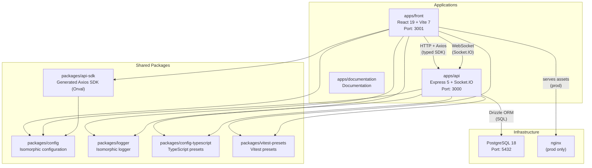

# Monorepo Architecture

## Overview

Kirona is a monorepo managed with **pnpm workspaces** and **Turborepo**. It contains two main applications, documentation, and four shared packages.

---

## Application Descriptions

### `apps/api`

Backend REST + WebSocket. Built on Express 5 with Socket.IO on the same port. Follows Clean Architecture (Domain / Application / Infrastructure) with 20 functional modules. Schema validation is handled by Zod; OpenAPI documentation is automatically generated via `@asteasolutions/zod-to-openapi`. Routes are registered via a TypeScript decorator system (`@Get`, `@Post`, etc.).

- **Runtime:** Node.js >= 18, tsx in dev, tsup for build
- **Default port:** 3000 (configurable via `BACKEND_PORT`)
- **Database:** PostgreSQL 18 + Drizzle ORM (14 migrations)
- **System endpoints:** `GET /status`, `GET /api/v1/docs` (Swagger UI), `GET /api/v1/openapi.json`

### `apps/front`

React 19 SPA compiled by Vite 7. Routing is file-based via TanStack Router (tree generated in `routeTree.gen.ts`). Data is managed by TanStack Query; global state by Zustand (3 stores: auth, theme, typing). Real-time communication goes through a singleton Socket.IO client.

- **Runtime:** Vite 7 (dev), nginx (prod)
- **Default port:** 3001 (configurable via `FRONTEND_PORT`)
- **Styling:** TailwindCSS 4 + Radix UI (headless components)

### `apps/documentation`

Project documentation artifacts (exploration notes, specifications, developer guides). No dependency on other packages.

---

## Shared Package Descriptions

### `packages/api-sdk`

Typed Axios SDK, **auto-generated** by Orval from the OpenAPI spec produced by the API. Do not edit manually — regenerate with `pnpm generate-sdk`. Exports functions named by HTTP verb (e.g. `gETContents`, `pOSTAuthLogin`).

No `dist/` folder — always import from source. Vitest must alias `@packages/api-sdk` to `packages/api-sdk/src/index.ts`.

### `packages/config`

Isomorphic environment configuration (works in both Node.js and the browser). Exports a `config` singleton with all typed environment variables (backend, frontend, database, external APIs, email, analytics). Provides `getEnvVar()`, `parseBool()`, `parseNumber()` helpers.

### `packages/logger`

Minimal isomorphic logger. Exports a `logger` singleton with four colorized methods: `info`, `warn`, `error`, `success`. The `logger/**` package is exempt from Biome's `noConsole` rules.

### `packages/config-typescript`

Shared TypeScript configuration presets used across all apps and packages in the monorepo. Avoids duplicating `tsconfig.json`.

### `packages/vitest-presets`

Shared Vitest configuration (alias resolution, `node` environment, coverage). Each app extends it according to its specific needs.

---

## Turborepo Pipeline

Turborepo orchestrates tasks while respecting the inter-package dependency graph. Tasks marked `cache: false` are never cached (side effects: DB, dev servers).

| Task | Depends on | Cache | Persistent |
|---|---|---|---|
| `generate-sdk` | `^generate-sdk` (parent packages) | yes | no |
| `build` | `^build` (parent packages) | yes | no |
| `build:watch` | `^build` | no | yes |
| `check-types` | `^build` | yes | no |
| `dev` | `^build` | no | yes |
| `db:migrate` | — | no | no |
| `lint` | `^build` | yes | no |
| `start` | `build` | yes | yes |
| `test` | `^build` | yes (coverage/) | no |

---

## Default Ports

| Service | Port | Env variable |
|---|---|---|
| Frontend (Vite dev) | 3001 | `FRONTEND_PORT` |
| API (Express) | 3000 | `BACKEND_PORT` |
| PostgreSQL | 5432 | `DB_PORT` |
| Frontend (prod, nginx) | 80 | `FRONT_PORT` |
