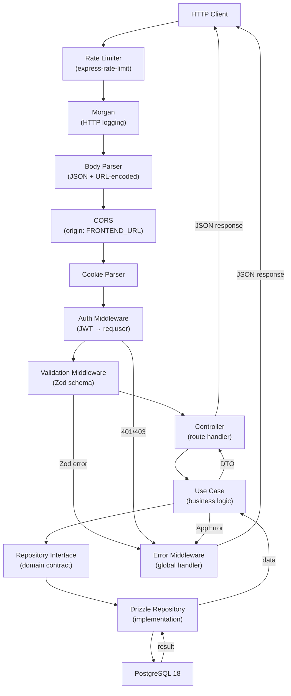
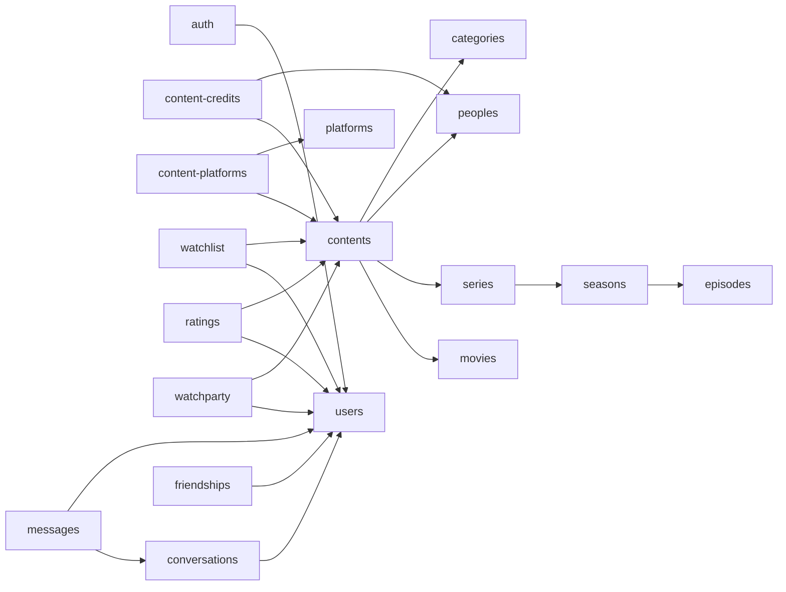

# Backend Architecture

## HTTP Request Flow



---

## Functional Modules

| Module | Functional Domain |
|---|---|
| `auth` | Authentication, JWT dual-token, email verification, password reset |
| `users` | User profiles, settings, account deletion |
| `contents` | Unified movies/series interface (CRUD, search, browse) |
| `movies` | Movie-specific data (duration, etc.) |
| `series` | TV series-specific data |
| `seasons` | TV series seasons |
| `episodes` | TV series episodes |
| `categories` | Content genres/categories |
| `peoples` | Actors, directors, crew |
| `platforms` | Streaming platforms (Netflix, Canal+, etc.) |
| `content-credits` | Content ↔ people associations (roles, characters) |
| `content-platforms` | Content availability on a platform + URL |
| `watchlist` | Viewing tracking (statuses: watching/completed/dropped/planning) |
| `ratings` | Ratings (1.0–5.0) and reviews on content |
| `watchparty` | Synchronized group viewing sessions |
| `conversations` | Messaging (DMs and groups, REST only) |
| `messages` | Individual messages (REST + WebSocket hybrid) |
| `friendships` | User relationships (pending/accepted/blocked) |

Note: exploration notes mention 20 modules; the registry actively registers 12 (`auth`, `users`, `categories`, `contents`, `movies`, `series`, `watchlist`, `peoples`, `watchparties`, `friendships`, `conversations`, `messages`). Modules `seasons`, `episodes`, `platforms`, `content-credits`, `content-platforms`, `ratings`, and `watchparty` exist in the code but their registration in the registry should be verified.

---

## Module Structure (Clean Architecture)

```
module-name/
├── module-name.module.ts          # Module class + dependency injection
├── application/
│   ├── controllers/               # HTTP handlers (and WS for hybrid modules)
│   ├── use-cases/                 # Pure business logic
│   ├── dto/
│   │   ├── requests/              # Zod validators for inputs
│   │   └── response/              # Zod validators for outputs
│   └── schema/                    # OpenAPI schemas
├── domain/
│   ├── entities/                  # Domain objects
│   └── interfaces/                # Repository contracts (IXxxRepository)
└── infrastructure/
    └── database/
        ├── schemas/               # Drizzle table definitions
        └── repositories/          # Implementations (Drizzle, TMDB, composite)
```

---

## Module Dependencies



---

## Shared Middleware

| Middleware | Role |
|---|---|
| `authMiddleware` | Extracts and verifies the JWT from the `Authorization` header or `accessToken` cookie. Populates `req.user` with `{ userId, email }`. |
| `optionalAuthMiddleware` | Variant without rejection if the token is absent (public routes with optional personalization). |
| `validationMiddleware` | Validates `req.body`, `req.query`, `req.params` via a Zod schema passed as parameter. |
| `errorMiddleware` | Global handler at the end of the chain. Converts `AppError` subclasses to JSON responses with the appropriate HTTP status. In production, reports to Sentry. |
| `socketAuthMiddleware` | Auth for Socket.IO: extracts the JWT from `handshake.query` or `handshake.headers.cookie`. |
| `requireRole()` | Verifies that `req.user` has the required role. |
| `requireOwnership()` | Verifies that the resource belongs to the logged-in user. |
| `rateLimiter` | `express-rate-limit` applied globally at the top of the chain. |

---

## Decorator System and Route Generation

Routes are not declared manually. Controllers use TypeScript decorators:

```
@Route("/contents")
class ContentsController {
  @Get("/")
  @Auth()
  @Validate(querySchema)
  async list(req, res) { ... }
}
```

The `DecoratorRouter` (`shared/infrastructure/decorators/rest/router-generator.ts`) traverses the metadata and generates an Express `Router` instance per module. The registry (`modules/index.ts`) mounts each router under `/api/v1`.

---

## Clean Architecture Consistency Assessment

**Points respected:**

- The domain layer (`domain/interfaces/`) defines abstract contracts (`IXxxRepository`) that the infrastructure layer implements. Use cases depend on interfaces, never on concrete implementations.
- Use cases have no knowledge of Express (no `Request`/`Response` imports).
- Zod DTOs ensure validation at the application boundaries.
- The Repository pattern is present and consistent.

**Notable nuances:**

- Routing decorators (`@Get`, `@Post`, `@Auth`) are applied directly to controller methods in `application/`. This is convenient but introduces a framework dependency in the application layer, which strict Clean Architecture discourages.
- Some modules use a "composite repository" pattern (`composite-{name}.repository.ts`) that aggregates heterogeneous data sources (Drizzle + TMDB). This approach is pragmatic and well-isolated.
- Dependency injection is manual (in `.module.ts` files), without an IoC container. This remains readable at the current project scale.
- The `src/database/schema.ts` file (3000+ lines) centralizes all table definitions. For a modular monolith, splitting by module would be stricter, but cohabitation in a central file is common with Drizzle.
