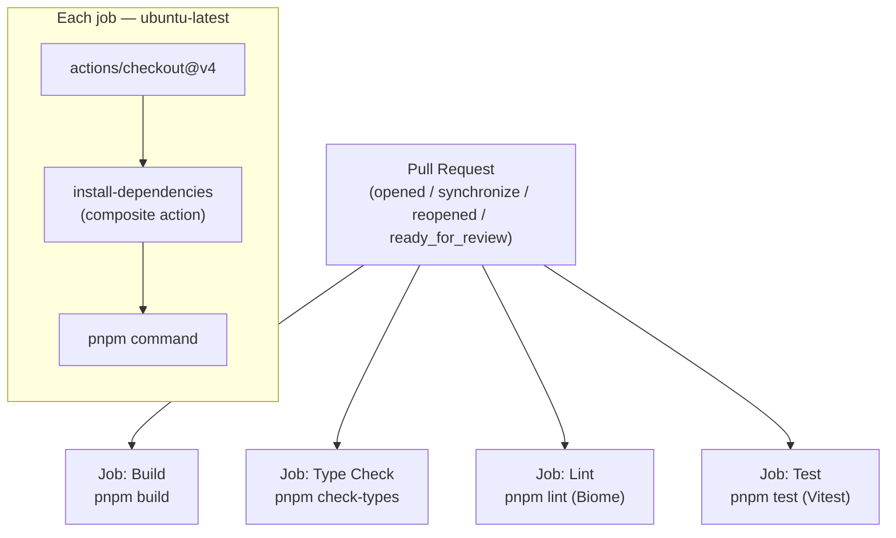
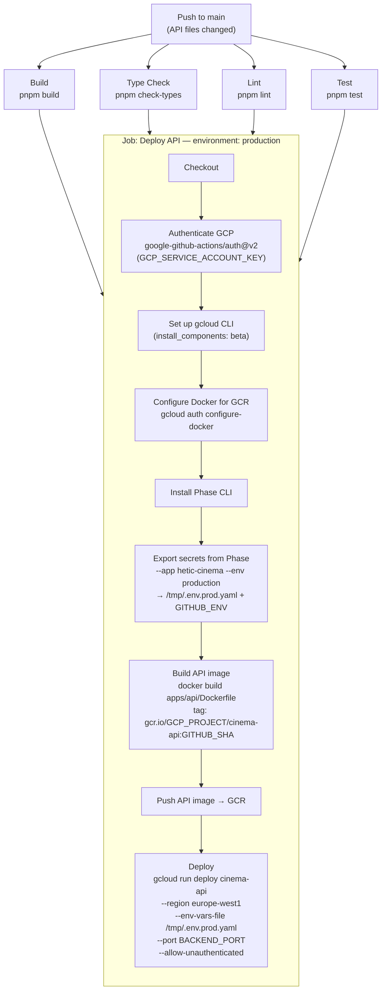
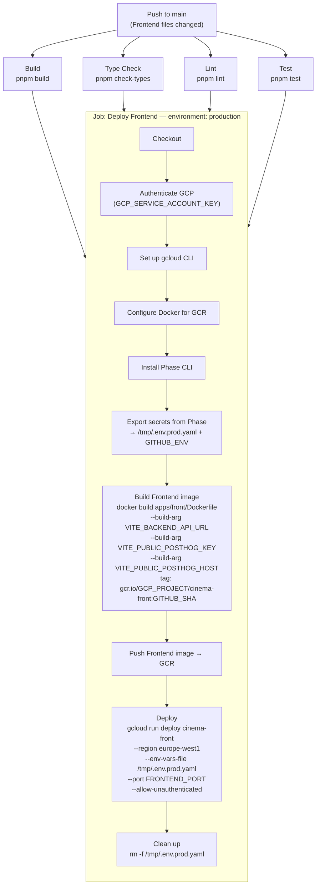
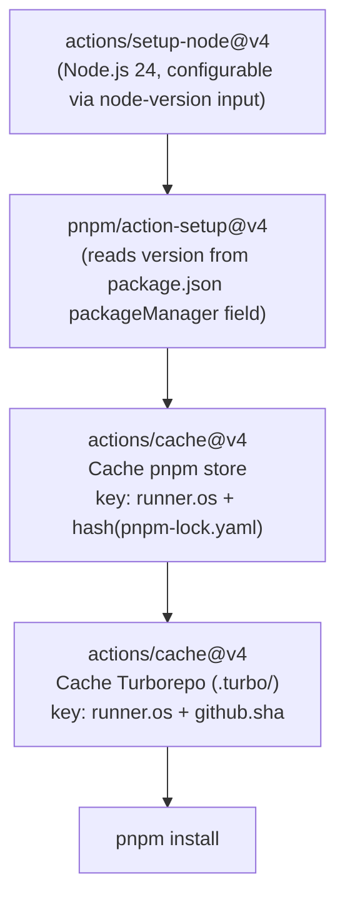
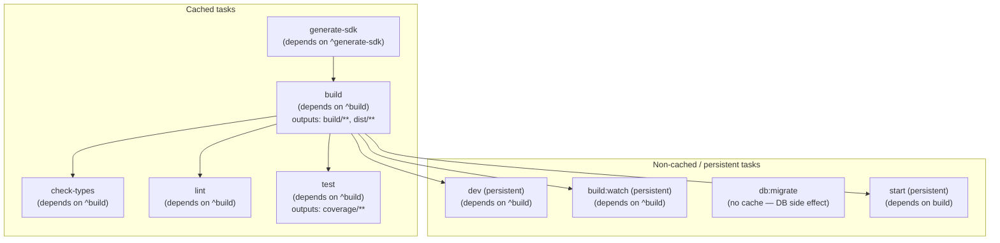

# CI/CD and Turborepo Pipeline

## GitHub Actions — Overview

Three workflow files live in `.github/workflows/`:

| Workflow | File | Trigger |
|---|---|---|
| `pre-merge` | `pull-request.yaml` | PR opened, synchronize, reopened, or ready_for_review |
| `deploy` (API) | `deploy-api.yaml` | Push to `main` — ignores frontend-only changes |
| `deploy` (Frontend) | `deploy-front.yaml` | Push to `main` — ignores API-only changes |

A reusable composite action handles dependency installation with caching:
`.github/actions/install-dependencies/action.yaml`

---

## `pre-merge` Workflow (`pull-request.yaml`)

Runs on every pull request event. Four jobs run **in parallel** — a PR is blocked if any one fails.



---

## Deploy Workflows

There are **two independent deploy workflows**, one per application. Each triggers on push to `main` but uses `paths-ignore` to skip when only unrelated files changed — a docs-only commit does not redeploy anything, and a frontend-only commit does not redeploy the API.

| Workflow | Skips deployment when all changed files are under… |
|---|---|
| `deploy-api.yaml` | `apps/front/`, `apps/docs/`, or `packages/api-sdk/` |
| `deploy-front.yaml` | `apps/api/` or `apps/docs/` |

Both share the same structure: **four validation jobs in parallel → one deploy job** gated on all four passing (`needs: [build, check-types, lint, test]`).

### API deploy (`deploy-api.yaml`)



### Frontend deploy (`deploy-front.yaml`)



**Key differences between the two deploy jobs:**
- The **frontend image** receives `VITE_BACKEND_API_URL`, `VITE_PUBLIC_POSTHOG_KEY`, and `VITE_PUBLIC_POSTHOG_HOST` as Docker `--build-arg`s. Vite bakes these into the static bundle at build time — they cannot be injected at runtime.
- The **API image** receives no build args — all config comes from the Cloud Run `--env-vars-file` at runtime.
- Cloud Run `--port` is set from `BACKEND_PORT` (API) and `FRONTEND_PORT` (frontend), both coerced to integers with `$(( PORT + 0 ))` before the `gcloud` call.

---

## Secrets injection (Phase → Cloud Run)

Both deploy workflows use the same Phase export pattern:

```bash
# 1. Export from Phase as YAML
phase secrets export --app hetic-cinema --env production --format yaml \
  > /tmp/.env.prod.raw.yaml

# 2. Coerce all values to strings (required by Cloud Run's --env-vars-file format)
yq e -o=yaml 'with_entries(.value |= tostring)' /tmp/.env.prod.raw.yaml \
  > /tmp/.env.prod.yaml

# 3. Also inject into GITHUB_ENV for use in subsequent steps (e.g. Docker build args)
yq e -r 'to_entries | .[] | "\(.key)=\(.value|tostring)"' /tmp/.env.prod.raw.yaml \
  >> "$GITHUB_ENV"
```

`PHASE_SERVICE_TOKEN` is stored as a GitHub Actions secret and passed to the export step as `env:`.

---

## Composite Action: `install-dependencies`

Reused by every job in all three workflows.



Two independent caches are maintained:
- **pnpm store**: keyed on `pnpm-lock.yaml` hash — stable across commits when dependencies don't change
- **Turborepo cache** (`.turbo/`): keyed on commit SHA with prefix fallback — unchanged packages skip rebuilding within the same workflow run

---

## Turborepo Pipeline

Turborepo orchestrates tasks in dependency order per `turbo.json`. Cached outputs are replayed when inputs (sources + env) haven't changed.



`^build` means "upstream packages in the dependency graph must build first". `persistent` tasks (dev servers) run indefinitely and are never cached.

---

## Pre-commit Hook (local)

Husky runs `lint-staged` on every commit:

```
.husky/pre-commit → lint-staged (lint-staged.config.js)
```

The staged-file pipeline mirrors CI:
1. `pnpm lint` (Biome)
2. `pnpm check-types --affected`
3. `pnpm test`
4. `pnpm build`

A commit only succeeds locally if it would also pass CI.

---

## Required GitHub Secrets

| Secret | Used by | Purpose |
|---|---|---|
| `GCP_SERVICE_ACCOUNT_KEY` | Both deploy workflows | GCP authentication (JSON key) |
| `PHASE_SERVICE_TOKEN` | Both deploy workflows | Phase CLI authentication for secrets export |
