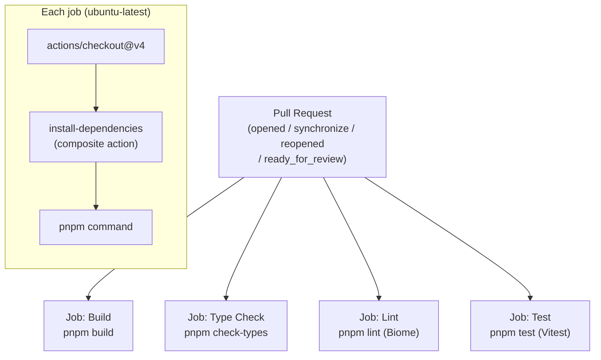
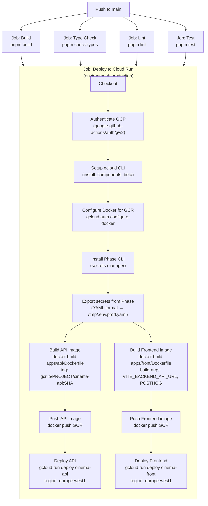
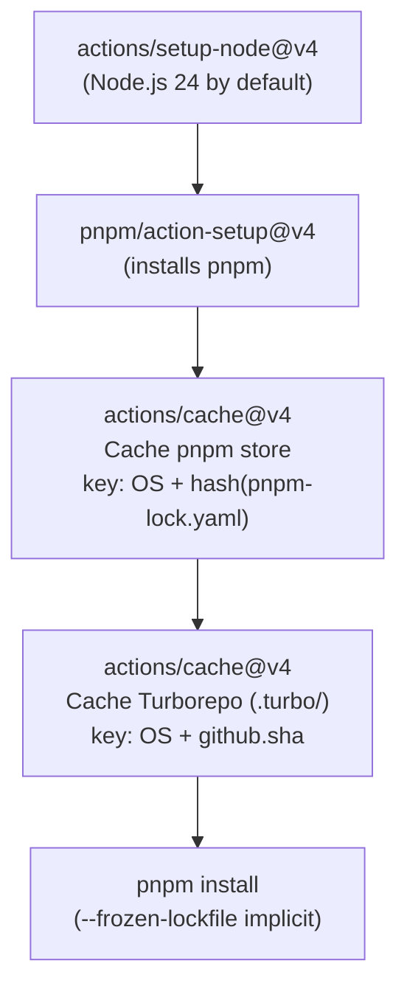
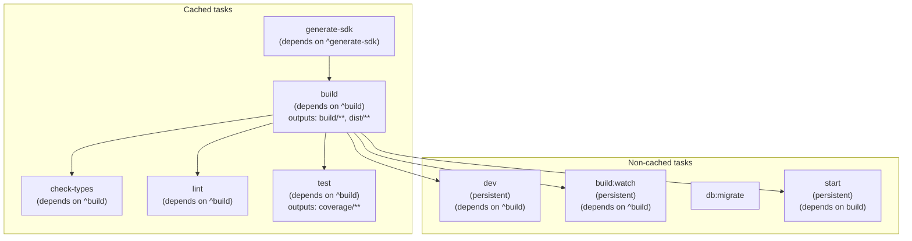

# CI/CD and Turborepo Pipeline

## GitHub Actions — Overview

Two GitHub Actions workflows are defined in `.github/workflows/`:

| Workflow | File | Trigger |
|---|---|---|
| `pre-merge` | `pull-request.yaml` | PR opened, synchronized, or reopened on any branch |
| `deploy` | `deploy.yaml` | Push to `main` branch |

A reusable composite action handles dependency installation with caching:
`.github/actions/install-dependencies/action.yaml`

---

## `pre-merge` Workflow (Pull Requests)



The four jobs are **independent** and run in parallel. No dependency between them — a PR can be blocked by any one of them.

---

## `deploy` Workflow (Production Deployment)



**Deployment condition:** the `deploy` job only starts if all four validation jobs (`build`, `check-types`, `lint`, `test`) have succeeded (`needs: [build, check-types, lint, test]`).

**Target platform:** Google Cloud Run (region `europe-west1`). Docker images are pushed to Google Container Registry (GCR).

**Secrets management:** Phase.dev is used as the secrets manager. The Phase CLI exports secrets from the `production` environment of the `hetic-cinema` app in YAML, then `yq` converts them to the format expected by Cloud Run.

---

## Composite Action: `install-dependencies`



This action is reused in each job of both workflows. It caches:
- The pnpm store (based on `pnpm-lock.yaml`)
- The Turborepo cache (based on the commit SHA)

---

## Turborepo Pipeline (tasks and dependencies)

Turborepo orchestrates tasks respecting the dependency graph declared in `turbo.json`. Cache is enabled by default unless stated otherwise.



**Graph reading:**
- `^build` means "the package must have built its upstream dependencies before running this task".
- Tasks `dev`, `build:watch`, and `start` are `persistent` (long-running processes, no expected end).
- `db:migrate` has no declared dependency and its cache is disabled (side effects on the database).

**Turborepo cache:** Turbo hashes inputs (sources, env variables) and replays cached outputs if nothing has changed. In CI, the `.turbo/` cache is restored via the composite action, avoiding rebuilding unmodified packages between runs.

---

## Pre-commit Hook (local)

Outside of CI, a Husky hook runs on every local commit via `lint-staged`:

```
.husky/pre-commit → lint-staged
```

`lint-staged.config.js` triggers on all staged files:
1. `pnpm lint` (Biome)
2. `pnpm check-types --affected`
3. `pnpm test`
4. `pnpm build`

This local pipeline is identical to CI, ensuring a commit can only pass locally if it would also pass in CI.
