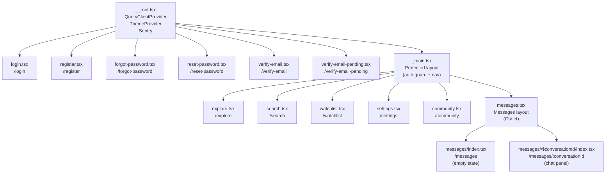
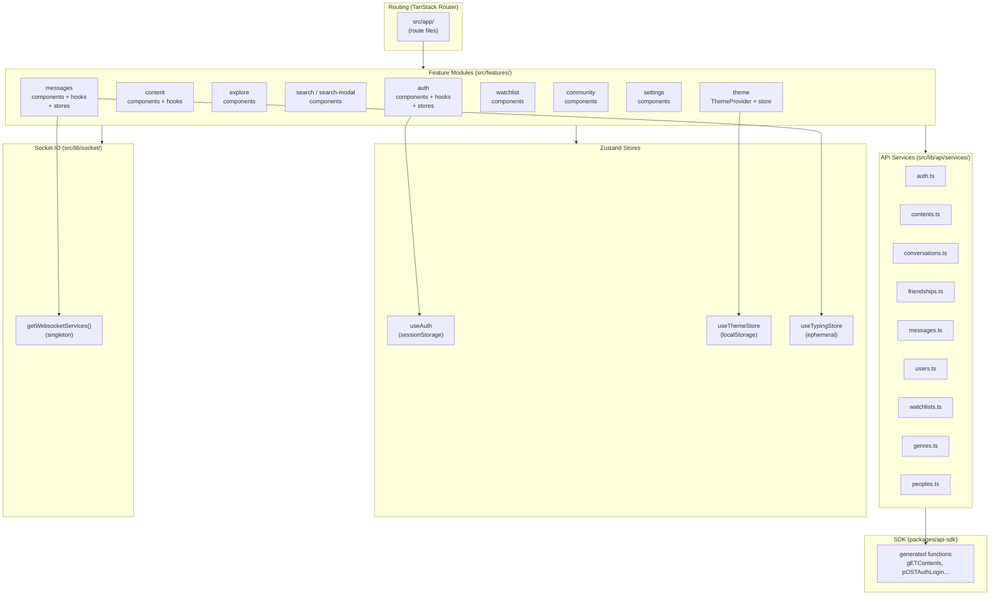

# Frontend Architecture

## Route Tree (TanStack Router)

Routing is file-based: TanStack Router automatically generates `routeTree.gen.ts` from files in `src/app/`.



**Note:** `_main.tsx` is a layout route (the `_` prefix = no URL segment). It wraps all protected routes with the navigation component and `SearchProvider`. `messages.tsx` is also a layout route that renders `<Outlet />`.

---

## Modular Frontend Architecture



---

## Service Pattern: Dual Export (imperative + reactive)

Each service exposes two interfaces:

| Export | Type | Usage |
|---|---|---|
| `xxxService` | Pure `async` functions | Event handlers, mutations outside React components |
| `queryXxxService` | `useQuery` / `useMutation` hooks (TanStack Query) | React components (reactive data) |

```typescript
// Imperative — in an onClick
const api = getApi();
await api.auth.login({ email, password });

// Reactive — in a React component
const { data } = queryContentService.getContents({ page: 1 });
```

---

## Zustand Stores

| Store | File | Persistence | Content |
|---|---|---|---|
| `useAuth` | `features/auth/stores/auth.store.ts` | sessionStorage (key `auth`) | `user`, `isLoading`, `error` + setters |
| `useThemeStore` | `features/theme/stores/theme.store.ts` | localStorage (key `theme-storage`) | `theme: "dark" \| "light" \| "system"` |
| `useTypingStore` | `features/messages/stores/typing.store.ts` | None (ephemeral) | `typingByConversation: Record<convId, userId[]>` |

---

## Auto-generated SDK Pipeline

```mermaid
flowchart LR
    ZOD["Zod Schemas\n(backend DTOs)\napps/api/src/modules/*/\napplication/dto/"]
    OPENAPI_GEN["@asteasolutions/zod-to-openapi\n(generated at build)"]
    OPENAPI_SPEC["apps/api/api-documentation.json\n(OpenAPI 3.x spec)"]
    ORVAL["Orval\n(code generator)"]
    SDK_GEN["packages/api-sdk/src/generated/\nmodels/ + services/"]
    SDK_INDEX["packages/api-sdk/src/index.ts\n(export point)"]
    TQ["TanStack Query hooks\n(in frontend services)\nqueryXxxService"]
    FRONT["React components\n(apps/front)"]

    ZOD --> OPENAPI_GEN
    OPENAPI_GEN --> OPENAPI_SPEC
    OPENAPI_SPEC --> ORVAL
    ORVAL --> SDK_GEN
    SDK_GEN --> SDK_INDEX
    SDK_INDEX --> TQ
    TQ --> FRONT
```



**Command:** `pnpm generate-sdk` (= `turbo run generate-sdk`)

**Generated function naming:** HTTP verb in uppercase followed by the route in camelCase (e.g. `gETContents`, `pOSTAuthLogin`, `dELETEUsersMe`). This reflects Orval's behavior with the current configuration.

**Important:** `packages/api-sdk` has no `dist/` folder. Imports must always be from source. The Vitest configuration must alias `@packages/api-sdk` to `packages/api-sdk/src/index.ts`.

---

## UI Components

23 components in `src/components/ui/` following shadcn conventions (Radix UI + TailwindCSS): `accordion`, `avatar`, `button`, `calendar`, `card`, `dialog`, `dropdown-menu`, `field`, `form`, `input`, `input-group`, `label`, `pagination`, `popover`, `scroll-area`, `select`, `separator`, `skeleton`, `tabs`, `textarea`, `tooltip`, and a `filters/` subdirectory.

---

## Entry Point (`main.tsx`)

1. Sentry initialization (error tracking, session replay, tracing)
2. TanStack Router instance creation from `routeTree.gen.ts`
3. `QueryClientProvider` setup
4. Wrap in `ThemeProvider`
5. Mount on `#root`
