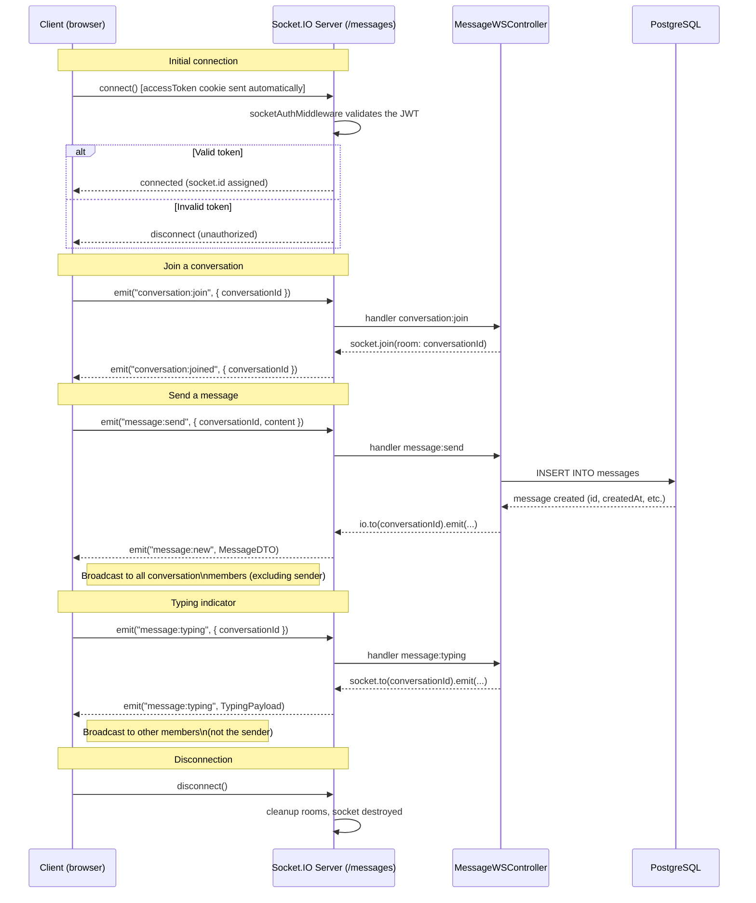

# Real-time Architecture (Socket.IO)

## Socket.IO Presence

Socket.IO is present and operational in the project:

- **Backend:** `socket.io` integrated in `apps/api/src/server.ts`, coexists with Express on the same port (3000).
- **Frontend:** `socket.io-client` 4.8.3 in `apps/front/src/lib/socket/socket-client.ts`.

---

## Active Namespace

A single namespace is active: **`/messages`**.

The server exposes Socket.IO on the `/socket.io` path with `websocket` and `polling` transports.

---

## Sequence Diagram



---

## Emitted and Received Events

### Events received by the server (Client → Server)

| Event | Payload | Description |
|---|---|---|
| `conversation:join` | `{ conversationId: string }` | Subscribes the socket to the conversation room. Required before receiving messages. |
| `message:send` | `{ conversationId: string, content: string }` | Sends a text message in a conversation. The server persists to the database and broadcasts. |
| `message:typing` | `{ conversationId: string }` | Signals that the user is typing. Broadcast to other members. |

### Events emitted by the server (Server → Client)

| Event | Payload | Description |
|---|---|---|
| `message:new` | `MessageDTO` | New message created in a conversation. Received by all members who have joined the room. |
| `message:typing` | `TypingPayload` | Typing indicator from another user in the conversation. |
| `conversation:joined` | `ConversationJoinedPayload` | Confirmation that the socket has joined the conversation room. |

---

## Socket.IO Client (frontend)

The client is a **singleton** initialized on first request (lazy initialization).

```
apps/front/src/lib/socket/socket-client.ts
```

**Interface exported via `getWebsocketServices()`:**

| Method | Description |
|---|---|
| `connect()` | Initializes and connects the socket |
| `disconnect()` | Disconnects and destroys the socket |
| `refreshAuth()` | Calls `refreshSocketAuth()` after a JWT token refresh |
| `emit.joinConversation(id)` | Emits `conversation:join` |
| `emit.sendMessage(id, content)` | Emits `message:send` |
| `emit.typing(id)` | Emits `message:typing` |
| `on.newMessage(handler)` | Subscribes to `message:new`, returns a cleanup function |
| `on.typing(handler)` | Subscribes to `message:typing`, returns a cleanup function |
| `on.conversationJoined(handler)` | Subscribes to `conversation:joined`, returns a cleanup function |

**Authentication:** the `accessToken` httpOnly cookie is automatically sent during the WebSocket handshake (`withCredentials: true`). The `socketAuthMiddleware` on the server side validates it before authorizing the connection.

**Reconnection after token refresh:** `refreshSocketAuth()` is called after a new `accessToken` has been obtained, to keep the Socket.IO session synchronized with the HTTP session.

---

## AsyncAPI

The backend generates an AsyncAPI spec (via `asyncapi-generator.ts`) accessible at `GET /docs/asyncapi.json`. It documents WebSocket events the same way OpenAPI documents REST endpoints.
