# Database — Documentation

**RDBMS:** PostgreSQL 18
**ORM:** Drizzle ORM
**Schema location:** `apps/api/src/database/schema.ts` (central file aggregating all module schemas)
**Number of tables:** 27 tables + 2 materialized views
**Number of migrations:** 15 (0000–0014)

---

## Table of Contents

1. [ERD Diagram](#erd-diagram)
2. [Table Descriptions](#table-descriptions)
3. [PostgreSQL Enums](#postgresql-enums)
4. [SQL Views](#sql-views)
5. [Indexes](#indexes)
6. [Migration Strategy](#migration-strategy)

---

## ERD Diagram

```mermaid
erDiagram
    users {
        uuid id PK
        varchar email UK
        varchar password_hash
        varchar username UK
        varchar display_name
        text avatar_url
        text bio
        varchar oauth_provider
        varchar oauth_id
        varchar theme
        varchar language
        boolean email_notifications
        timestamp created_at
        timestamp updated_at
        timestamp last_login_at
        timestamp email_verified_at
    }

    refresh_tokens {
        uuid id PK
        uuid user_id FK
        varchar token_hash
        timestamp expires_at
        timestamp created_at
        timestamp revoked_at
        inet ip_address
        text user_agent
        varchar device_fingerprint
    }

    email_verification_tokens {
        uuid id PK
        uuid user_id FK
        varchar token_hash UK
        timestamp expires_at
        timestamp used_at
        timestamp created_at
    }

    password_reset_tokens {
        uuid id PK
        uuid user_id FK
        varchar token_hash UK
        timestamp expires_at
        timestamp used_at
        timestamp created_at
    }

    content {
        uuid id PK
        varchar type
        varchar title
        varchar original_title
        varchar slug UK
        text synopsis
        text poster_url
        text backdrop_url
        text trailer_url
        date release_date
        integer year
        integer duration_minutes
        integer tmdb_id UK
        numeric average_rating
        integer total_ratings
        integer total_views
        timestamp created_at
        timestamp updated_at
    }

    categories {
        uuid id PK
        varchar name UK
        varchar slug UK
        text description
        integer tmdb_id
        timestamp created_at
    }

    content_categories {
        uuid content_id FK
        uuid category_id FK
    }

    people {
        uuid id PK
        varchar name
        text bio
        text photo_url
        date birth_date
        varchar nationality
        integer tmdb_id UK
        timestamp created_at
        timestamp updated_at
    }

    content_credits {
        uuid id PK
        uuid content_id FK
        uuid person_id FK
        varchar role
        varchar character_name
        integer order_index
    }

    streaming_platforms {
        uuid id PK
        varchar name UK
        varchar slug UK
        text logo_url
        text base_url
        boolean is_supported
        integer tmdb_id
        timestamp created_at
    }

    content_platforms {
        uuid content_id FK
        uuid platform_id FK
        text key
    }

    seasons {
        uuid id PK
        uuid series_id FK
        integer season_number
        varchar name
        text overview
        text poster_url
        date air_date
        integer tmdb_id
        integer episode_count
    }

    episodes {
        uuid id PK
        uuid season_id FK
        integer episode_number
        varchar name
        text overview
        text still_url
        date air_date
        integer duration_minutes
        integer tmdb_id
    }

    watchlists {
        uuid id PK
        uuid user_id FK
        uuid content_id FK
        watchlistStatus status
        integer current_season
        integer current_episode
        timestamp added_at
        timestamp started_at
        timestamp completed_at
    }

    ratings {
        uuid id PK
        uuid user_id FK
        uuid content_id FK
        numeric rating
        timestamp created_at
        timestamp updated_at
    }

    reviews {
        uuid id PK
        uuid user_id FK
        uuid content_id FK
        varchar title
        text content
        boolean is_spoiler
        uuid parent_review_id FK
        integer likes_count
        timestamp created_at
        timestamp updated_at
        timestamp deleted_at
    }

    review_likes {
        uuid user_id FK
        uuid review_id FK
        timestamp created_at
    }

    lists {
        uuid id PK
        uuid user_id FK
        varchar name
        text description
        boolean is_public
        text cover_image_url
        integer likes_count
        integer items_count
        timestamp created_at
        timestamp updated_at
    }

    list_items {
        uuid id PK
        uuid list_id FK
        uuid content_id FK
        integer order_index
        text note
        timestamp added_at
    }

    list_likes {
        uuid user_id FK
        uuid list_id FK
        timestamp created_at
    }

    friendships {
        uuid id PK
        uuid user_id FK
        uuid friend_id FK
        friendship_status status
        timestamp created_at
        timestamp updated_at
    }

    conversations {
        uuid id PK
        varchar type
        varchar name
        text avatar_url
        uuid created_by FK
        timestamp created_at
        timestamp updated_at
    }

    conversation_participants {
        uuid id PK
        uuid conversation_id FK
        uuid user_id FK
        timestamp joined_at
        timestamp last_read_at
        varchar role
    }

    messages {
        uuid id PK
        uuid conversation_id FK
        uuid user_id FK
        text content
        varchar type
        uuid watchparty_id FK
        timestamp created_at
        timestamp updated_at
        timestamp deleted_at
    }

    watchparties {
        uuid id PK
        uuid created_by FK
        uuid content_id FK
        uuid season_id FK
        uuid episode_id FK
        varchar name
        text description
        boolean is_public
        integer max_participants
        uuid platform_id FK
        text platform_url
        timestamp scheduled_at
        timestamp started_at
        timestamp ended_at
        varchar status
        integer current_position_timestamp
        boolean is_playing
        uuid leader_user_id FK
        timestamp created_at
        timestamp updated_at
    }

    watchparty_participants {
        uuid id PK
        uuid watchparty_id FK
        uuid user_id FK
        varchar status
        timestamp joined_at
        timestamp left_at
        integer total_watch_time_seconds
    }

    watchparty_invitations {
        uuid id PK
        uuid watchparty_id FK
        uuid inviter_id FK
        uuid invitee_id FK
        varchar invite_token UK
        timestamp expires_at
        timestamp used_at
        timestamp created_at
    }

    notifications {
        uuid id PK
        uuid user_id FK
        varchar type
        varchar title
        text message
        uuid related_user_id FK
        uuid related_content_id FK
        uuid related_watchparty_id FK
        boolean is_read
        timestamp created_at
    }

    user_stats {
        uuid user_id PK
        integer total_watch_time_minutes
        integer total_movies_watched
        integer total_series_watched
        integer total_episodes_watched
        integer total_watchparties_created
        integer total_watchparties_joined
        integer total_reviews_written
        integer total_lists_created
        uuid favorite_genre_id FK
        integer favorite_decade
        timestamp updated_at
    }

    user_activity_logs {
        uuid id PK
        uuid user_id FK
        varchar event_type
        uuid content_id FK
        uuid watchparty_id FK
        jsonb metadata
        timestamp created_at
    }

    people_likes {
        uuid user_id FK
        uuid person_id FK
        timestamp created_at
    }

    tmdb_fetch_status {
        uuid id PK
        varchar path UK
        varchar type
        jsonb metadata
        timestamp expires_at
        timestamp created_at
        timestamp updated_at
    }

    users ||--o{ refresh_tokens : "has"
    users ||--o{ email_verification_tokens : "has"
    users ||--o{ password_reset_tokens : "has"
    users ||--o{ watchlists : "has"
    users ||--o{ ratings : "has"
    users ||--o{ reviews : "has"
    users ||--o{ review_likes : "has"
    users ||--o{ lists : "has"
    users ||--o{ list_likes : "has"
    users ||--o{ people_likes : "has"
    users ||--o{ friendships : "initiates"
    users ||--o{ friendships : "receives"
    users ||--o{ conversations : "creates"
    users ||--o{ conversation_participants : "participates"
    users ||--o{ messages : "sends"
    users ||--o{ watchparties : "creates"
    users ||--o{ watchparties : "leads"
    users ||--o{ watchparty_participants : "participates"
    users ||--o{ watchparty_invitations : "invites"
    users ||--o{ watchparty_invitations : "receives"
    users ||--o{ notifications : "receives"
    users ||--o{ user_stats : "has"
    users ||--o{ user_activity_logs : "has"
    content ||--o{ content_categories : "has"
    content ||--o{ content_credits : "has"
    content ||--o{ content_platforms : "available on"
    content ||--o{ seasons : "has"
    content ||--o{ watchlists : "in"
    content ||--o{ ratings : "receives"
    content ||--o{ reviews : "receives"
    content ||--o{ list_items : "in"
    content ||--o{ watchparties : "subject"
    content ||--o{ notifications : "referenced"
    content ||--o{ user_activity_logs : "referenced"
    categories ||--o{ content_categories : "classifies"
    categories ||--o{ user_stats : "favorite"
    people ||--o{ content_credits : "has"
    people ||--o{ people_likes : "receives"
    streaming_platforms ||--o{ content_platforms : "hosts"
    streaming_platforms ||--o{ watchparties : "used in"
    seasons ||--o{ episodes : "contains"
    seasons ||--o{ watchparties : "subject"
    episodes ||--o{ watchparties : "subject"
    lists ||--o{ list_items : "contains"
    lists ||--o{ list_likes : "receives"
    conversations ||--o{ conversation_participants : "has"
    conversations ||--o{ messages : "contains"
    reviews ||--o{ reviews : "reply"
    reviews ||--o{ review_likes : "receives"
    watchparties ||--o{ watchparty_participants : "has"
    watchparties ||--o{ watchparty_invitations : "has"
    watchparties ||--o{ messages : "linked"
    watchparties ||--o{ notifications : "referenced"
    watchparties ||--o{ user_activity_logs : "referenced"
```



---

## Table Descriptions

### Authentication and Users

#### `users`
Central system table. Stores user accounts with OAuth support (Google, etc.) and classic email/password authentication. The `oauth_or_email` constraint ensures at least one of the two modes is configured.

| Column | Type | Description |
|--------|------|-------------|
| `id` | uuid PK | Randomly generated unique identifier |
| `email` | varchar(255) UNIQUE | Email address (btree index) |
| `password_hash` | varchar(255) | bcrypt hash of the password (null if OAuth) |
| `username` | varchar(50) UNIQUE | Username normalized to lowercase |
| `display_name` | varchar(100) | Public display name |
| `avatar_url` | text | Avatar URL |
| `bio` | text | Free-form biography |
| `oauth_provider` | varchar(50) | OAuth provider (e.g. "google") |
| `oauth_id` | varchar(255) | Identifier at the OAuth provider |
| `theme` | varchar(20) | Theme preference (default: "dark") |
| `language` | varchar(10) | Preferred language (default: "fr") |
| `email_notifications` | boolean | Email notifications enabled (default: true) |
| `email_verified_at` | timestamp | Email verification date (null = not verified) |
| `last_login_at` | timestamp | Date of last login |

#### `refresh_tokens`
JWT refresh tokens stored server-side. Enables revocation and session traceability.

| Column | Type | Description |
|--------|------|-------------|
| `token_hash` | varchar(255) | SHA hash of the token (btree index) |
| `expires_at` | timestamp | Expiration date (7 days) |
| `revoked_at` | timestamp | Revocation date (null = active) |
| `ip_address` | inet | IP at token creation |
| `device_fingerprint` | varchar(255) | Device fingerprint |

#### `email_verification_tokens`
Single-use tokens for email address verification. Generated at registration and when resending verification.

#### `password_reset_tokens`
Single-use tokens sent by email for password reset. Configurable expiration, marked `used_at` after use.

---

### Content

#### `content`
Central cinema content table. Represents either a movie (`type = 'movie'`) or a series (`type = 'serie'`). The `valid_type` constraint ensures the type field is consistent.

| Column | Type | Description |
|--------|------|-------------|
| `type` | varchar(20) | `'movie'` or `'serie'` (CHECK constraint) |
| `slug` | varchar(255) UNIQUE | URL-friendly identifier (btree index) |
| `tmdb_id` | integer UNIQUE | The Movie Database ID (btree index) |
| `average_rating` | numeric(3,2) | Average rating (computed, default 0) |
| `total_ratings` | integer | Total number of ratings received |
| `total_views` | integer | View count |
| `duration_minutes` | integer | Duration in minutes (movies) |

#### `categories`
Cinematographic genres. Synchronized from TMDB via `tmdb_id`.

#### `content_categories`
N:N junction table between `content` and `categories`. Composite primary key `(content_id, category_id)`.

#### `people`
Actors, directors, and other professionals. Unique `tmdb_id` field to deduplicate imports.

#### `content_credits`
Association between content and a person with their role (`actor`, `director`, etc.) and character name for actors. Uniqueness constraint on `(role, person_id, content_id)`.

#### `streaming_platforms`
Streaming platforms (Netflix, Disney+, etc.). Referenced in `content_platforms` and `watchparties`.

#### `content_platforms`
N:N junction table between `content` and `streaming_platforms`. The `key` field contains the content identifier on the platform. Composite primary key `(content_id, platform_id)`.

#### `seasons`
Seasons of a series. References `content.id` (parent series). Uniqueness constraint on `(series_id, season_number)` and `season_number > 0` check.

#### `episodes`
Episodes of a season. Uniqueness constraint on `(season_id, episode_number)` and `episode_number > 0` check.

#### `tmdb_fetch_status`
TMDB request cache to avoid redundant API calls. Supported types: `'discover'` and `'search'`. The `remove_expired` constraint automatically filters expired entries.

---

### User Activity

#### `watchlists`
Personal viewing tracking. One entry per `(user_id, content_id)` pair. Progress fields (`current_season`, `current_episode`) for series.

#### `ratings`
Individual ratings (1.0 to 5.0 with decimal precision). One rating per `(user_id, content_id)` pair. CHECK constraint: `rating >= 1.0 AND rating <= 5.0`.

#### `reviews`
Text reviews. Supports replies via `parent_review_id` (self-reference). Soft delete via `deleted_at`.

#### `review_likes`
Junction table for "likes" on reviews. Composite primary key `(user_id, review_id)`.

#### `lists`
Custom content lists (public watchlist type). Denormalized `likes_count` and `items_count` fields for performance.

#### `list_items`
Items in a list with order (`order_index`). Uniqueness constraint `(list_id, content_id)`.

#### `list_likes`
Junction table for "likes" on lists. Composite primary key `(user_id, list_id)`.

#### `user_stats`
Aggregated statistics per user. `user_id` is the PK (1:1 relationship with `users`). Denormalized updates to avoid costly aggregations.

#### `user_activity_logs`
User activity log. JSONB `metadata` field to store variable contextual data depending on `event_type`.

#### `people_likes`
Junction table for "likes" on people. Composite primary key `(user_id, person_id)`.

---

### Social

#### `friendships`
Friendship relationships between users. The `no_self_friend` constraint prevents self-friendship. Uniqueness constraint `(user_id, friend_id)`.

#### `conversations`
Conversations (DM or group). The `type` field distinguishes types (observed values: `dm`, `group`). `created_by` can be NULL if the user is deleted (ON DELETE SET NULL).

#### `conversation_participants`
Conversation participants with their role (`member`, `admin`). Uniqueness constraint `(user_id, conversation_id)`. `last_read_at` enables unread message calculation.

#### `messages`
Text messages. Soft delete via `deleted_at`. Optional association to a watchparty via `watchparty_id`. ON DELETE SET NULL on `user_id` to preserve messages if the author is deleted.

#### `notifications`
System notifications. Optional relationships to a user, content, or watchparty for context. `is_read` enables filtering.

---

### Watchparties

#### `watchparties`
Synchronized viewing events. Can target an entire content, a season, or a specific episode. Real-time control fields: `current_position_timestamp`, `is_playing`, `leader_user_id`.

#### `watchparty_participants`
Watchparty participants. Observed statuses: `invited`, `confirmed`, `left`. `total_watch_time_seconds` counter per participant.

#### `watchparty_invitations`
Watchparty invitations with a unique token (`invite_token`) for shared links. Uniqueness constraint `(watchparty_id, invitee_id)`.

---

## PostgreSQL Enums

| Enum name | Values | Used in |
|---------------|---------|--------------|
| `watchlistStatus` | `plan_to_watch`, `watching`, `completed`, `dropped`, `undecided`, `not_interested` | `watchlists.status` |
| `friendship_status` | `pending`, `accepted`, `rejected` | `friendships.status` |

---

## SQL Views

### `popular_content`
View computing a popularity score based on the combination of rating count and average rating.

```sql
-- Popularity score = COUNT(ratings) * AVG(rating)
-- Sorted by descending popularity
SELECT c.*, COALESCE(AVG(r.rating), 0)::numeric(3,2) AS average_rating,
       COUNT(r.id)::integer AS total_ratings,
       COALESCE(COUNT(r.id)::numeric * AVG(r.rating), 0) AS popularity_score
FROM content c LEFT JOIN ratings r ON r.content_id = c.id
GROUP BY c.id ORDER BY popularity_score DESC
```

### `upcoming_watchparties`
View of upcoming watchparties (status `scheduled`, `scheduled_at > now()`). Enriched with the creator's name, content title, platform name, and confirmed participant count.

---

## Indexes

| Index | Table | Columns | Purpose |
|-------|-------|----------|---------|
| `idx_users_email` | `users` | `email` | Email lookup (login) |
| `idx_users_oauth` | `users` | `(oauth_provider, oauth_id)` | OAuth auth |
| `idx_refresh_tokens_hash` | `refresh_tokens` | `token_hash` | Token validation |
| `idx_refresh_tokens_user` | `refresh_tokens` | `user_id` | Sessions per user |
| `idx_refresh_tokens_expires` | `refresh_tokens` | `expires_at` | Expired token cleanup |
| `idx_content_tmdb` | `content` | `tmdb_id` | TMDB import |
| `idx_content_slug` | `content` | `slug` | URL resolution |
| `idx_content_type` | `content` | `type` | Movie/series filtering |
| `idx_content_year` | `content` | `year` | Decade filtering |
| `idx_content_rating` | `content` | `average_rating DESC` | Popular ranking |
| `idx_messages_conversation` | `messages` | `(conversation_id, created_at DESC)` | Paginated message loading |
| `idx_notifications_user` | `notifications` | `(user_id, is_read, created_at DESC)` | Notification list |
| `idx_watchparties_scheduled` | `watchparties` | `(scheduled_at, status)` | Upcoming events |
| `idx_friendships_user` | `friendships` | `(user_id, status)` | Friends list by status |
| `idx_invitations_token` | `watchparty_invitations` | `invite_token` | Invitation link resolution |

---

## Migration Strategy

### Tool
Drizzle Kit (`drizzle-kit`) manages migrations declaratively. TypeScript schemas are the source of truth; SQL migrations are generated by diff.

### Commands

```bash
# Generate a migration from schema changes
cd apps/api && pnpm db:generate

# Apply pending migrations
cd apps/api && pnpm db:migrate

# Inspect the database via GUI
cd apps/api && pnpm db:studio
```

### History

| Migration | Period | Approximate content |
|-----------|---------|---------------------|
| `0000` | February 2026 | Initial schema: users, content, watchlist, ratings, reviews, friendships |
| `0001–0011` | February–March 2026 | Watchparties, messages, invitations, notifications, statistics |
| `0012–0014` | March 2026 | Mailgun tokens, cleanup, adjustments |

### Conventions
- All PKs are randomly generated UUIDs (`defaultRandom()`)
- Timestamps use timezone (`withTimezone: true`)
- Cascade deletions (`ON DELETE CASCADE`) are systematic to maintain referential integrity
- `ON DELETE SET NULL` is used when data must be preserved without its author (e.g. messages after account deletion)
