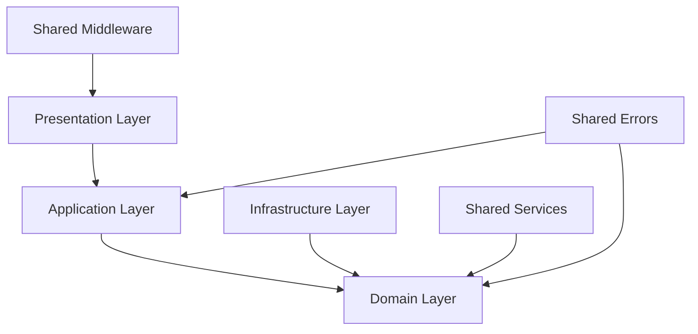

# 📁 Project Structure

This document provides a comprehensive overview of how the Cinema API codebase is organized, explaining the purpose of each directory, file naming conventions, and the rationale behind the structure.

## High-Level Structure

```
apps/api/
├── src/                    # Source code
│   ├── config/            # Configuration files
│   ├── database/          # Database-related files
│   ├── modules/           # Feature modules
│   ├── shared/            # Shared utilities and services
│   └── index.ts           # Application entry point
│
├── package.json           # Dependencies and scripts
├── tsconfig.json          # TypeScript configuration
├── drizzle.config.ts      # Database ORM configuration
└── vitest.config.ts       # Test configuration
```

## Detailed Directory Structure

### Root Level (`apps/api/`)

```
apps/api/
├── src/                   # All TypeScript source code
├── dist/                  # Compiled JavaScript (generated)
├── node_modules/          # Dependencies (generated)
├── coverage/              # Test coverage reports (generated)
│
├── package.json           # Project metadata and dependencies
├── tsconfig.json          # TypeScript compiler configuration
├── drizzle.config.ts      # Database ORM configuration
├── vitest.config.ts       # Test framework configuration
├── eslint.config.js       # Code linting rules
└── turbo.json             # Monorepo build configuration
```

### Source Code (`src/`)

```
src/
├── config/                # Configuration management
│   ├── database.ts        # Database connection config
│   └── drizzle.ts         # Drizzle ORM configuration
│
├── database/              # Database layer
│   ├── index.ts           # Database client and utilities
│   ├── schema.ts          # Aggregated database schemas
│   ├── migrations/        # Database migration files (generated)
│   └── seeds/             # Database seed data
│
├── modules/               # Business feature modules
│   ├── auth/              # Authentication module
│   ├── users/             # User management module
│   └── index.ts           # Module aggregation and routing
│
├── shared/                # Shared utilities and services
│   ├── errors/            # Custom error classes
│   ├── middleware/        # Express middleware
│   ├── services/          # Shared services (password, tokens)
│   └── utils/             # Utility functions
│
├── index.ts               # Application entry point
└── server.ts              # Express server configuration
```

## Module Structure

Each module follows a consistent **Clean Architecture** pattern:

```
modules/[module-name]/
├── domain/                # Business logic layer
│   ├── entities/          # Business entities
│   ├── interfaces/        # Contracts and abstractions
│   ├── errors/            # Domain-specific errors
│   └── index.ts           # Domain layer exports
│
├── application/           # Use cases layer
│   ├── dto/               # Data Transfer Objects
│   ├── validators/        # Input validation schemas
│   ├── use-cases/         # Business use cases
│   ├── controllers/       # HTTP request handlers
│   └── index.ts           # Application layer exports
│
├── infrastructure/        # External concerns layer
│   ├── database/          # Database access
│   │   ├── schemas/       # Database table definitions
│   │   └── repositories/  # Data access implementations
│   └── services/          # External service integrations
│
├── presentation/          # Interface layer
│   └── routes/            # HTTP route definitions
│
└── [module-name].module.ts # Module configuration and DI
```

### Example: Users Module Structure

```
modules/users/
├── domain/
│   ├── entities/
│   │   └── user.entity.ts           # User business entity
│   ├── interfaces/
│   │   └── IUserRepository.ts       # User repository contract
│   ├── errors/
│   │   ├── UserNotFoundError.ts
│   │   ├── EmailAlreadyExistsError.ts
│   │   └── UsernameAlreadyExistsError.ts
│   └── index.ts
│
├── application/
│   ├── dto/
│   │   └── user.dto.ts              # User DTOs and transformers
│   ├── validators/
│   │   └── user.validator.ts        # Zod validation schemas
│   ├── use-cases/
│   │   ├── GetUserById.usecase.ts
│   │   ├── GetUsers.usecase.ts
│   │   ├── UpdateUser.usecase.ts
│   │   ├── DeleteUser.usecase.ts
│   │   └── index.ts
│   ├── controllers/
│   │   └── users.controller.ts      # HTTP request handlers
│   └── index.ts
│
├── infrastructure/
│   └── database/
│       ├── schemas/
│       │   └── users.schema.ts      # Drizzle table definition
│       └── repositories/
│           └── UserRepository.ts    # Database access implementation
│
├── presentation/
│   └── routes/
│       └── users.routes.ts          # Express route definitions
│
└── users.module.ts                  # Dependency injection setup
```

## Shared Components Structure

### Error Handling (`shared/errors/`)

```
shared/errors/
├── AppError.ts            # Base error class
├── UnauthorizedError.ts   # 401 authentication errors
├── ForbiddenError.ts      # 403 authorization errors
├── NotFoundError.ts       # 404 resource not found
├── ValidationError.ts     # 400 validation errors
├── ConflictError.ts       # 409 resource conflicts
└── index.ts               # Barrel export
```

### Middleware (`shared/middleware/`)

```
shared/middleware/
├── auth.middleware.ts     # JWT authentication
├── validation.middleware.ts # Request validation with Zod
├── error.middleware.ts    # Global error handling
└── index.ts               # Barrel export
```

### Services (`shared/services/`)

```
shared/services/
├── password/
│   ├── IPasswordService.ts    # Password service interface
│   ├── PasswordService.ts     # bcrypt implementation
│   └── index.ts               # Service exports
│
├── token/
│   ├── ITokenService.ts       # Token service interface
│   ├── JWTService.ts          # JWT implementation
│   └── index.ts               # Service exports
│
└── [other-services]/          # Additional shared services
```

### Utilities (`shared/utils/`)

```
shared/utils/
├── asyncHandler.ts        # Async error handling wrapper
└── index.ts               # Utility exports
```

## File Naming Conventions

### General Rules

1. **Case Sensitivity**: Use `camelCase` for file names
2. **Descriptive Names**: Files should clearly indicate their purpose
3. **Consistency**: Follow the same pattern across the entire codebase

### Specific Patterns

#### Entities

```
user.entity.ts             # ✅ Clear entity designation
film.entity.ts
watchparty.entity.ts
```

#### Use Cases

```
GetUserById.usecase.ts      # ✅ Action + UseCase suffix
CreateUser.usecase.ts       # ✅ PascalCase for class names
UpdateUser.usecase.ts
DeleteUser.usecase.ts
```

#### Controllers

```
users.controller.ts         # ✅ Plural resource + controller
auth.controller.ts
films.controller.ts
```

#### Routes

```
users.routes.ts             # ✅ Resource + routes suffix
auth.routes.ts
films.routes.ts
```

#### DTOs

```
user.dto.ts                 # ✅ Resource + dto suffix
auth.dto.ts
```

#### Validators

```
user.validator.ts           # ✅ Resource + validator suffix
auth.validator.ts
```

#### Repositories

```
UserRepository.ts           # ✅ PascalCase class name
FilmRepository.ts
```

#### Schemas (Database)

```
users.schema.ts             # ✅ Table name + schema suffix
films.schema.ts
ratings.schema.ts
```

#### Interfaces

```
IUserRepository.ts          # ✅ I prefix for interfaces
IPasswordService.ts
ITokenService.ts
```

#### Errors

```
UserNotFoundError.ts        # ✅ Descriptive error name
EmailAlreadyExistsError.ts
```

#### Module Files

```
users.module.ts             # ✅ Module name + module suffix
auth.module.ts
```

#### Index Files

```
index.ts                    # ✅ Barrel exports in each directory
```

## 🔗 Import Path Conventions

### Absolute Imports

Using TypeScript path mapping for clean imports:

```typescript
// tsconfig.json path configuration
{
  "compilerOptions": {
    "baseUrl": ".",
    "paths": {
      "@/*": ["src/*"],
      "@/shared/*": ["src/shared/*"],
      "@/modules/*": ["src/modules/*"],
      "@/database": ["src/database"],
      "@/config/*": ["src/config/*"]
    }
  }
}
```

### Import Examples

```typescript
// ✅ Shared utilities
import { asyncHandler } from "@/shared/utils";
import { authMiddleware } from "@/shared/middleware";
import { AppError } from "@/shared/errors";

// ✅ Module imports
import { User } from "@/modules/users/domain/entities/user.entity";
import type { IUserRepository } from "@/modules/users/domain/interfaces/IUserRepository";

// ✅ Database and config
import { db } from "@/database";
import { databaseConfig } from "@/config/database";
```

### Import Order Convention

1. **External libraries** (Node modules)
2. **Internal absolute imports** (@/ paths)
3. **Relative imports** (./ ../)

```typescript
// 1. External libraries
import { Router } from "express";
import { z } from "zod";

// 2. Internal absolute imports
import { asyncHandler } from "@/shared/utils";
import type { IUserRepository } from "@/modules/users/domain";

// 3. Relative imports
import type { AuthController } from "../controllers/auth.controller";
import { createUserSchema } from "./validators/user.validator";
```

## Module Dependencies

### Dependency Flow Rules



### Allowed Dependencies

#### Domain Layer Can Import:

- ✅ Other domain entities
- ✅ Shared errors (domain-specific)
- ❌ Application layer
- ❌ Infrastructure layer
- ❌ Presentation layer

#### Application Layer Can Import:

- ✅ Domain layer (entities, interfaces, errors)
- ✅ Shared services (via interfaces)
- ✅ Shared errors
- ❌ Infrastructure layer
- ❌ Presentation layer

#### Infrastructure Layer Can Import:

- ✅ Domain layer (interfaces, entities)
- ✅ External libraries (Drizzle, bcrypt, etc.)
- ✅ Shared services
- ❌ Application layer
- ❌ Presentation layer

#### Presentation Layer Can Import:

- ✅ Application layer (controllers, DTOs)
- ✅ Shared middleware
- ✅ Shared errors
- ❌ Domain layer directly
- ❌ Infrastructure layer directly

## Test File Organization

### Test Structure

```
src/
├── modules/
│   └── users/
│       ├── domain/
│       │   └── __tests__/
│       │       └── user.entity.test.ts
│       ├── application/
│       │   └── __tests__/
│       │       ├── use-cases/
│       │       │   └── GetUserById.usecase.test.ts
│       │       └── controllers/
│       │           └── users.controller.test.ts
│       └── infrastructure/
│           └── __tests__/
│               └── repositories/
│                   └── UserRepository.test.ts
```

### Test Naming Convention

```
[FileName].test.ts          # ✅ Unit tests
[FileName].integration.test.ts # ✅ Integration tests
[FileName].e2e.test.ts      # ✅ End-to-end tests
```

## Configuration Files

### TypeScript Configuration

```typescript
// tsconfig.json
{
  "compilerOptions": {
    "target": "ES2022",
    "module": "ESNext",
    "moduleResolution": "node",
    "strict": true,
    "esModuleInterop": true,
    "skipLibCheck": true,
    "forceConsistentCasingInFileNames": true,
    "baseUrl": ".",
    "paths": {
      "@/*": ["src/*"],
      "@/shared/*": ["src/shared/*"],
      "@/modules/*": ["src/modules/*"]
    }
  },
  "include": ["src/**/*"],
  "exclude": ["node_modules", "dist"]
}
```

### Package.json Scripts

```json
{
  "scripts": {
    "dev": "tsx watch src/index.ts",
    "build": "tsc",
    "start": "node dist/index.js",
    "test": "vitest run",
    "test:watch": "vitest",
    "db:generate": "drizzle-kit generate",
    "db:migrate": "drizzle-kit migrate",
    "db:push": "drizzle-kit push",
    "lint": "eslint src/ --max-warnings 0",
    "type-check": "tsc --noEmit"
  }
}
```

## Benefits of This Structure

### 1. **Predictability**

- Developers know exactly where to find specific functionality
- Consistent patterns across all modules
- Easy navigation and file discovery

### 2. **Scalability**

- Easy to add new modules without affecting existing code
- Clear boundaries prevent tight coupling
- Parallel development across teams

### 3. **Maintainability**

- Changes are isolated to specific layers and modules
- Clear dependency rules prevent architectural drift
- Easy to refactor or replace components

### 4. **Testability**

- Test files are co-located with source code
- Clear separation allows focused testing strategies
- Dependency injection enables easy mocking

## Common Structure Mistakes

### ❌ Mixing Concerns

```
// Bad: Business logic in controller
src/controllers/users.controller.ts
├── HTTP handling ✅
├── Business validation ❌ (should be in use case)
└── Database queries ❌ (should be in repository)
```

### ❌ Circular Dependencies

```
// Bad: Circular dependency
modules/users/domain/User.ts
└── imports from modules/auth/ ❌

modules/auth/domain/Session.ts
└── imports from modules/users/ ❌
```

### ❌ Deep Nesting

```
// Bad: Too many nested directories
src/modules/users/application/services/validators/helpers/utils/
└── user-validation-helper.ts ❌
```

### ❌ Inconsistent Naming

```
// Bad: Mixed naming conventions
UserController.ts      ✅ PascalCase for classes
user-service.ts        ❌ kebab-case
userRepo.ts           ❌ Abbreviated names
user_entity.ts        ❌ snake_case
```

## Tools and Automation

### Path Mapping Setup

Configured in `tsconfig.json` for clean imports throughout the application.

### ESLint Rules

Custom rules enforce consistent file organization and naming.

### IDE Configuration

Recommended VS Code settings for consistent development experience.

## Summary

The Cinema API project structure is designed around:

1. **Clean Architecture Principles** - Clear layer separation
2. **Module-Based Organization** - Feature-focused grouping
3. **Consistent Conventions** - Predictable file naming and location
4. **Scalable Design** - Easy to extend and maintain
5. **Developer Experience** - Intuitive navigation and understanding

This structure supports the project's goals of maintainability, testability, and team collaboration while providing a solid foundation for future growth.

## Related Documentation

- [**Clean Architecture Principles**](clean-architecture.md) - Architectural philosophy
- [**Module Pattern**](module-pattern.md) - Deep dive into modules
- [**Creating a Module**](../../strategy/api/creating-a-new-module.md) - Practical implementation guide
