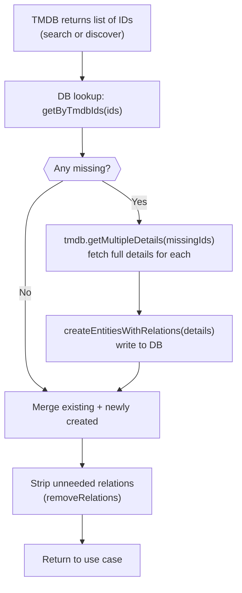

# Content Ingestion

Kirona has no seed data. The database starts empty and fills up organically as users browse or search. This document explains exactly what happens when content data is requested — from the incoming API call to the fully-populated PostgreSQL row returned to the client.

For the high-level architecture (composite repository pattern, layer diagram), see [TMDB Integration](tmdb-integration.md). This document focuses on the runtime mechanics.

---

## No seed. No pre-import.

Every movie, TV series, category, streaming platform, cast member, season, and episode record in the database was created in response to a user request. TMDB's catalogue is used as an on-demand remote data source, not a dataset to bulk-import.

**Consequences:**
- First request for a given content is slower (TMDB fetch + DB write)
- Subsequent requests for the same content are fast (DB read only)
- The database only contains content users have actually touched

---

## Two entry points

`BaseCompositeRepository` exposes two methods used by the concrete repositories (`CompositeMoviesRepository`, `CompositeSeriesRepository`):

| Method | When used | TMDB call |
|---|---|---|
| `baseList(title?, categories?, ...)` | Browse / explore page | `discover` (no title) or `search` (with title) |
| `baseSearch(query, options?)` | Search bar | `search` always |

Both follow the same fetch-or-create logic described below. The difference is only in how TMDB IDs are obtained.

### `baseList` — browse with filters

```
baseList(title, country, categories, withCategories, withPlatforms, ...)
  if title:
    tmdb.search({ query: title, page, withCategories: [tmdbIds] })
  else:
    tmdb.discover({ page, withCategories: [tmdbIds] })
```

Category filter: the local DB category IDs are resolved to TMDB genre IDs before being sent to TMDB, since TMDB only understands its own genre IDs.

### `baseSearch` — keyword search

```
baseSearch(query, options)
  tmdb.search({ query, page })
```

---

## The fetch-or-create loop

Both methods converge on the same logic after obtaining a list of TMDB IDs:



**Key property**: `getByTmdbIds` is the single gate. If a record already exists in the DB it is never re-fetched from TMDB, regardless of how many users request it concurrently.

---

## `createEntitiesWithRelations` — writing a new content record

When TMDB IDs are missing from the database, `createEntitiesWithRelations` is called with the full detail objects returned by `tmdb.getMultipleDetails()`.

It runs in three phases:

### Phase 1 — Pre-sync shared relations

Before creating any content row, all referenced categories (genres), providers (streaming platforms), and cast members are synced across the entire batch:

```
collect all genres across all entities (deduped by TMDB ID)
collect all providers across all entities (deduped)
collect all cast members across all entities (deduped)

ensureCategoriesExist(allGenres)
ensureProvidersExist(allProviders)
ensureCastsExist(allCast)
```

Deduplication happens in memory via `Map<tmdbId, data>` before any DB call. If 10 movies in the batch all share the genre "Action", `ensureCategoriesExist` receives it once.

### Phase 2 — Create content + link relations

For each entity in the batch (sequentially, to avoid race conditions):

```
drizzleRepository.create(entityData)          → inserts the content row
drizzleRepository.linkCategories(id, [...])   → inserts join rows
drizzleRepository.linkProviders(id, [...])    → inserts join rows
drizzleRepository.linkCasts(id, [...])        → inserts join rows with role/character

if series:
  ensureSeasonsExist(seasons, entityId)
    → for each season: create season row
    → ensureEpisodesExist(episodes, seasonId)
        → for each episode: create episode row
```

Failures on individual entities are caught and logged — they do not abort the batch. The error count is reported at the end.

### Phase 3 — Read-back with full relations

After the batch is written, a single `getByTmdbIds` call re-fetches all created entities with all relations populated (`withCast`, `withCategories`, `withPlatforms`, `withSeasons`, `withEpisodes` all true). This ensures the returned objects are complete regardless of what the caller requested.

---

## The `ensure*Exist` pattern (idempotent sync)

Every shared relation type uses the same idempotent sync pattern. Here it is for categories, but providers, cast, seasons, and episodes follow the same structure:

```
ensureCategoriesExist(genres[]):
  1. Filter genres not already in categoryCache → uncachedGenres
  2. Bulk-lookup uncachedGenres in DB by TMDB ID
  3. Populate categoryCache from DB hits
  4. Diff: genres still missing from DB → missingGenres
  5. For each missing genre:
       a. Generate slug
       b. Check DB by slug (handles slug collisions)
       c. CREATE the category row
       d. Write to categoryCache
       e. On error: retry findByTmdbId and cache if found
```

This pattern guarantees:
- A genre row is never created twice for the same TMDB ID
- The in-memory cache is always consistent with the DB at the end
- Errors on one genre do not block others

---

## In-memory caches

Five module-level `Map` instances persist for the lifetime of the process:

| Cache | Key | Value | Purpose |
|---|---|---|---|
| `categoryCache` | TMDB genre ID | DB category UUID | Avoid repeated category lookups |
| `providerCache` | TMDB provider ID | DB platform UUID | Avoid repeated platform lookups |
| `castCache` | TMDB cast ID | DB people UUID | Avoid repeated cast lookups |
| `seasonCache` | TMDB season ID | DB season UUID | Avoid repeated season lookups |
| `episodeCache` | TMDB episode ID | DB episode UUID | Avoid repeated episode lookups |

**These caches are in-process memory**, not Redis or any shared store. They are:
- Warm from the first request that populates them
- Lost on process restart (but repopulated from DB on the next `ensure*Exist` call)
- Not shared between worker processes (if you horizontally scale)

The `ensure*Exist` functions always check the cache first and only hit the DB for IDs not already cached.

---

## Opt-in relations

Content is always stored with all relations (categories, platforms, cast, seasons, episodes). But returning all of them on every endpoint would be wasteful.

The caller opts in per-relation via boolean flags:

```typescript
baseList(title, country, categories,
  withCategories: true,
  withPlatforms: false,
  withCast: false,
  withSeasons: false,
  withEpisodes: false,
  options,
)
```

After the fetch-or-create loop, any relation the caller did not opt into is stripped from the returned entities via `entity.removeRelations(key)`:

```typescript
if (!withCategories) allEntities.forEach(e => e.removeRelations("contentCategories"));
if (!withPlatforms)  allEntities.forEach(e => e.removeRelations("contentPlatforms"));
if (!withCast)       allEntities.forEach(e => e.removeRelations("contentCredits"));
if (!withSeasons)    allEntities.forEach(e => e.removeRelations("seasons"));
```

This means the DB always has the full data; only the API response is scoped.

---

## Series vs. Movies

Seasons and episodes are only processed when `drizzleRepository.contentType === "serie"`. The `ensureSeasonsExist` and `ensureEpisodesExist` methods return immediately if called on a movie repository.

Series ingestion adds two extra levels of nesting:
```
serie
└── season 1
    ├── episode 1
    ├── episode 2
    └── ...
└── season 2
    └── ...
```

Each level uses the same idempotent ensure pattern. Episode cache keyed on TMDB episode ID prevents duplicate episode rows when the same series is requested multiple times before it is fully written.

---

## What gets written on first request

When a user requests a movie or series that does not yet exist in the database, the following rows are created as a side effect:

| Table | Rows created |
|---|---|
| `content` | 1 per movie/series |
| `categories` | N genres (if not already present) |
| `content_categories` | N join rows |
| `streaming_platforms` | N providers (if not already present) |
| `content_platforms` | N join rows |
| `peoples` | N cast members (if not already present) |
| `content_credits` | N join rows (with character/role) |
| `seasons` | N seasons (series only) |
| `episodes` | N×M episodes (series only) |

All subsequent requests for the same content read directly from PostgreSQL — no TMDB call is made.
