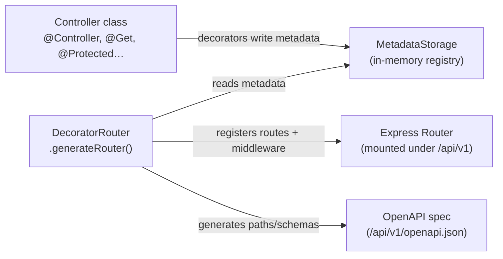

# Decorator System

The API uses a TypeScript decorator system to declare routes, validation, authentication, and OpenAPI documentation — all on the controller class without touching Express directly. This document explains how each decorator works and how they are processed by the `DecoratorRouter`.

---

## Overview



When a decorator like `@Get("/movies")` runs, it does not call Express. It writes metadata to `MetadataStorage` using `Reflect.metadata`. The `DecoratorRouter` reads all that metadata once, at module bootstrap, and builds the Express `Router` and OpenAPI spec from it.

---

## MetadataStorage

**File:** `apps/api/src/shared/infrastructure/decorators/rest/metadata-storage.ts`

A central singleton that stores four categories of metadata keyed on the controller's prototype:

| Category | Key | What is stored |
|---|---|---|
| Controller | `CONTROLLER_METADATA` | `{ tag, prefix, description }` |
| Routes | `ROUTES_METADATA` | Array of `{ method, path, summary, description, handlerName }` |
| Validation | `VALIDATION_METADATA` | `{ body?, query?, params? }` — Zod schemas per handler |
| Middlewares | `MIDDLEWARES_METADATA` | Array of marker strings (e.g. `AUTH_MIDDLEWARE_MARKER`) |
| Responses | `API_RESPONSES_METADATA` | Array of `{ status, description, schema }` per handler |

All decorators write to this storage; `DecoratorRouter` reads from it.

---

## Class-level decorator

### `@Controller(options)`

```typescript
@Controller({
  tag: "Watchlist",
  prefix: "/watchlist",
  description: "Watchlist management endpoints",
})
export class WatchlistController extends BaseController { ... }
```

Writes to `MetadataStorage.setControllerMetadata(target, options)`.

- `tag` — the OpenAPI tag (groups endpoints in Swagger UI)
- `prefix` — prepended to every route path in this controller
- `description` — shown in Swagger UI

All controllers must extend `BaseController`.

---

## Route decorators

### `@Get`, `@Post`, `@Put`, `@Patch`, `@Delete`

```typescript
@Get({
  path: "/:id",
  summary: "Get watchlist entry by ID",
  description: "Returns a single watchlist entry for the authenticated user.",
})
getWatchlistById = asyncHandler(async (req, res) => { ... });
```

Or the shorthand form:

```typescript
@Get("/:id")
getWatchlistById = asyncHandler(async (req, res) => { ... });
```

Each decorator writes a `RouteMetadata` entry: `{ method: "get", path, summary, description, handlerName }`.

**Path conversion:** Express uses `:id` for parameters; OpenAPI uses `{id}`. The `DecoratorRouter` converts between them automatically when building the spec.

---

## Validation decorators

These decorators attach Zod schemas that are executed **before** the handler via `validationMiddleware`.

### `@ValidateBody(schema)`

```typescript
@Post("/")
@ValidateBody(addContentToWatchlistBodyValidator)
addContentToWatchlist = asyncHandler(async (req, res) => {
  const body = req.body as AddContentToWatchlistBody; // already validated
});
```

### `@ValidateQuery(schema)`

```typescript
@Get("/")
@ValidateQuery(queryWatchlistValidator)
queryWatchlist = asyncHandler(async (req, res) => {
  const query = req.query as QueryWatchlistRequest; // already validated
});
```

### `@ValidateParams(schema)`

```typescript
@Delete("/:id")
@ValidateParams(z.object({ id: z.string().uuid() }))
deleteById = asyncHandler(async (req, res) => {
  const { id } = req.params; // validated UUID
});
```

When validation fails, the middleware throws a `ValidationError` (400) with Zod's field-level error details before the handler is ever called.

---

## Auth decorators

### `@Protected()`

Marks a route as requiring a valid JWT. The `DecoratorRouter` inserts `authMiddleware` into the middleware chain for this route.

```typescript
@Get("/me")
@Protected()
getMe = asyncHandler(async (req, res) => {
  const user = req.user; // populated by authMiddleware
});
```

`authMiddleware` reads the token from:
1. `Authorization: Bearer <token>` header
2. `accessToken` httpOnly cookie

If no valid token is found, it throws `UnauthorizedError` (401).

### `@OptionalAuth()` (when needed)

For routes that personalize their response when a user is logged in but also work anonymously.

---

## Cookie decorators

### `@SetCookie(name, options)`

Documents in the OpenAPI spec that this endpoint sets a cookie. Does **not** call `res.cookie()` — you still do that in the handler. This decorator is for Swagger documentation only.

```typescript
@Post("/login")
@SetCookie("refreshToken", { httpOnly: true, maxAge: 604800000 })
@SetCookie("accessToken", { httpOnly: true, maxAge: 900000 })
login = asyncHandler(async (req, res) => {
  res.cookie("refreshToken", refreshToken, REFRESH_TOKEN_COOKIE_OPTIONS);
  res.cookie("accessToken", accessToken, ACCESS_TOKEN_COOKIE_OPTIONS);
  res.status(200).json({ ... });
});
```

### `@RefreshTokenCookie()`

Convenience decorator that marks the route as requiring the `refreshToken` cookie in the request. Used on the `/auth/refresh` endpoint.

---

## OpenAPI decorator

### `@ApiResponse(status, description, schema)`

Declares a possible response for the OpenAPI spec. Multiple responses can be stacked.

```typescript
@Post("/")
@ValidateBody(registerValidator)
@ApiResponse(201, "Registration successful", successResponseSchema)
@ApiResponse(400, "Invalid input", validationErrorResponseSchema)
@ApiResponse(409, "Email already in use", conflictErrorResponseSchema)
register = asyncHandler(async (req, res) => { ... });
```

These are purely for documentation. They do not change runtime behavior.

---

## DecoratorRouter

**File:** `apps/api/src/shared/infrastructure/decorators/rest/router-generator.ts`

This class reads all decorator metadata and turns it into a running Express router plus an OpenAPI 3.0 spec.

### Usage (inside a module)

```typescript
const decoratorRouter = new DecoratorRouter();
const router = decoratorRouter.generateRouter(controllerInstance);
```

### What `generateRouter` does

For each route found in metadata:

```
1. Resolve full path   prefix + route.path  →  "/watchlist/:id"
2. Collect middleware in this order:
   a. Required headers check (if @RequiredHeaders)
   b. Required cookies check (if @RefreshTokenCookie)
   c. Body validation middleware  (if @ValidateBody)
   d. Query validation middleware (if @ValidateQuery)
   e. Params validation middleware (if @ValidateParams)
   f. authMiddleware              (if @Protected)
   g. The route handler itself
3. Register:  router[method](path, ...middlewares)
4. Register OpenAPI path entry with request/response schemas
```

### Generating the OpenAPI spec

```typescript
// After all modules have been instantiated:
const spec = generateOpenAPISpec(); // collects from all DecoratorRouter instances
```

The spec is served at `GET /api/v1/openapi.json` and rendered by Swagger UI at `GET /api/v1/docs`.

---

## Full example

```typescript
import { z } from "zod";
import { Controller } from "../../shared/infrastructure/decorators/rest/controller.decorator.js";
import { Get, Post, Delete } from "../../shared/infrastructure/decorators/rest/route.decorators.js";
import { Protected } from "../../shared/infrastructure/decorators/rest/auth.decorator.js";
import { ValidateBody, ValidateParams } from "../../shared/infrastructure/decorators/rest/validation.decorators.js";
import { ApiResponse } from "../../shared/infrastructure/decorators/rest/response.decorator.js";
import { BaseController } from "../../shared/infrastructure/base/controllers/base-controller.js";
import { asyncHandler } from "../../shared/utils/asyncHandler.js";
import {
  successResponseSchema,
  createSuccessResponseSchema,
} from "../../shared/schemas/base/response.schemas.js";
import { notFoundErrorResponseSchema } from "../../shared/schemas/base/error.schemas.js";
import type { GetItemUseCase } from "../application/use-cases/get-item.usecase.js";
import type { CreateItemUseCase } from "../application/use-cases/create-item.usecase.js";
import type { DeleteItemUseCase } from "../application/use-cases/delete-item.usecase.js";
import { createItemValidator } from "../dto/request/create-item.dto.js";
import { itemResponseValidator } from "../dto/response/item.response.validator.js";

@Controller({
  tag: "Items",
  prefix: "/items",
  description: "Item management",
})
export class ItemController extends BaseController {
  constructor(
    private readonly getItemUseCase: GetItemUseCase,
    private readonly createItemUseCase: CreateItemUseCase,
    private readonly deleteItemUseCase: DeleteItemUseCase
  ) {
    super();
  }

  @Get({
    path: "/:id",
    summary: "Get item by ID",
  })
  @Protected()
  @ValidateParams(z.object({ id: z.string().uuid() }))
  @ApiResponse(200, "Item found", createSuccessResponseSchema(itemResponseValidator))
  @ApiResponse(404, "Item not found", notFoundErrorResponseSchema)
  getById = asyncHandler(async (req, res) => {
    const item = await this.getItemUseCase.execute(req.params.id);
    res.status(200).json({ success: true, data: item });
  });

  @Post({
    path: "/",
    summary: "Create item",
  })
  @Protected()
  @ValidateBody(createItemValidator)
  @ApiResponse(201, "Created", createSuccessResponseSchema(itemResponseValidator))
  create = asyncHandler(async (req, res) => {
    const item = await this.createItemUseCase.execute(req.user!.userId, req.body);
    res.status(201).json({ success: true, data: item });
  });

  @Delete({
    path: "/:id",
    summary: "Delete item",
  })
  @Protected()
  @ValidateParams(z.object({ id: z.string().uuid() }))
  @ApiResponse(200, "Deleted", successResponseSchema)
  @ApiResponse(404, "Item not found", notFoundErrorResponseSchema)
  delete = asyncHandler(async (req, res) => {
    await this.deleteItemUseCase.execute(req.user!.userId, req.params.id);
    res.status(200).json({ success: true, message: "Item deleted" });
  });
}
```

---

## Common mistakes

| Mistake | Fix |
|---|---|
| Calling `res.json()` before `await` completes | Always `await` use case calls before writing the response |
| Forgetting `asyncHandler` wrapper | Wrap every handler with `asyncHandler` so async errors reach the error middleware |
| Using `req.body` without `@ValidateBody` | Add the validator; without it the body is unvalidated raw input |
| Accessing `req.user` without `@Protected()` | Add `@Protected()` or handle the `undefined` case explicitly |
| Writing routes in the wrong order | Specific routes (e.g. `/content/:id`) must come before wildcard routes (e.g. `/:id`) if they share a prefix |
