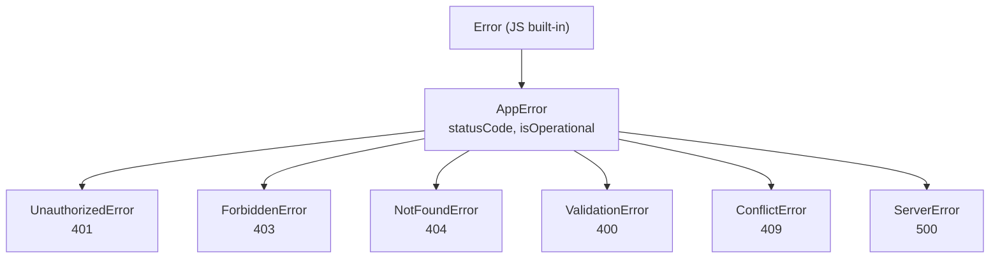
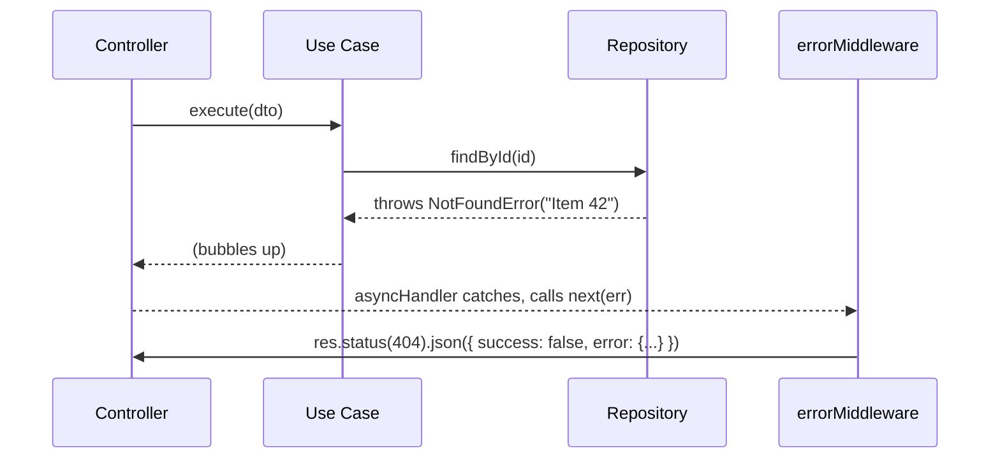

# Error Handling

All errors in the API follow a single propagation path: thrown in any layer → caught by `errorMiddleware` → formatted as a consistent JSON response.

---

## Error class hierarchy



**File:** `apps/api/src/shared/errors/`

| Class | HTTP | `errorCode` | When to use |
|---|---|---|---|
| `UnauthorizedError` | 401 | `UNAUTHORIZED` | Missing or invalid token; wrong password |
| `ForbiddenError` | 403 | `FORBIDDEN` | Authenticated but lacks permission; email not verified |
| `NotFoundError` | 404 | `NOT_FOUND` | Resource does not exist |
| `ValidationError` | 400 | `VALIDATION_ERROR` | Invalid input (also thrown automatically by Zod middleware) |
| `ConflictError` | 409 | `CONFLICT` | Duplicate record (unique constraint violation) |
| `ServerError` | 500 | `SERVER_ERROR` | Unexpected internal failure |

---

## Throwing errors

Throw the most specific subclass from anywhere in a use case or repository:

```typescript
// Use case
const user = await this.userRepository.findByEmail(email);
if (!user) {
  throw new UnauthorizedError("Invalid email or password");
}

// Repository
if (!result[0]) {
  throw new NotFoundError(`User with id ${id}`);
}

// Conflict detection from DB error message
if (dbError.message.includes("unique") || dbError.message.includes("duplicate")) {
  throw new ConflictError("Email already in use");
}
```

**Never throw raw `Error` objects from application/domain code.** Use the typed subclasses so the error middleware can format the response correctly.

---

## Error propagation path



The `asyncHandler` utility wraps every controller handler and calls `next(error)` on any thrown exception, so errors always reach `errorMiddleware` regardless of whether they come from use cases or repositories.

---

## `errorMiddleware`

**File:** `apps/api/src/shared/middleware/error.middleware.ts`

```
AppError subclass  →  { success: false, error: { code, message, details? } }  with statusCode
Unknown error      →  500 + generic message (original logged, not exposed)
Production         →  error also forwarded to Sentry
```

Response format:

```json
{
  "success": false,
  "error": {
    "code": "NOT_FOUND",
    "message": "User with id abc-123 not found",
    "details": null
  }
}
```

For `ValidationError` (thrown by Zod middleware), `details` is an array of field errors:

```json
{
  "success": false,
  "error": {
    "code": "VALIDATION_ERROR",
    "message": "Validation failed",
    "details": [
      { "field": "email", "message": "Invalid email" },
      { "field": "password", "message": "Required" }
    ]
  }
}
```

---

## Validation errors (Zod)

Validation middleware runs **before** the handler. When a `@ValidateBody`, `@ValidateQuery`, or `@ValidateParams` schema fails, it automatically throws `ValidationError` with Zod's field-level messages. You never need to check `req.body` for validity inside a handler — if the handler runs, the input is valid.

---

## Rules summary

- Use typed `AppError` subclasses everywhere in application and domain code
- Never leak internal error details (stack traces, DB messages) to the client
- Use `ServerError` as a last resort for truly unexpected failures
- Let `errorMiddleware` handle formatting — do not call `res.status(500)` manually in handlers
