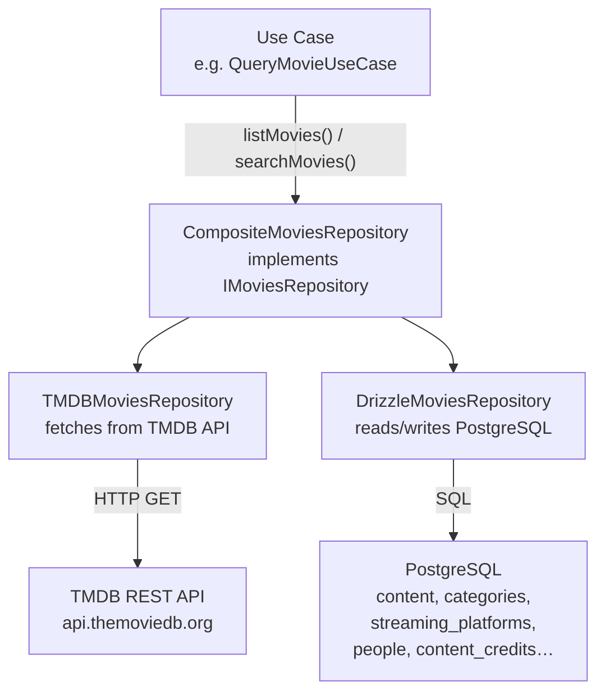
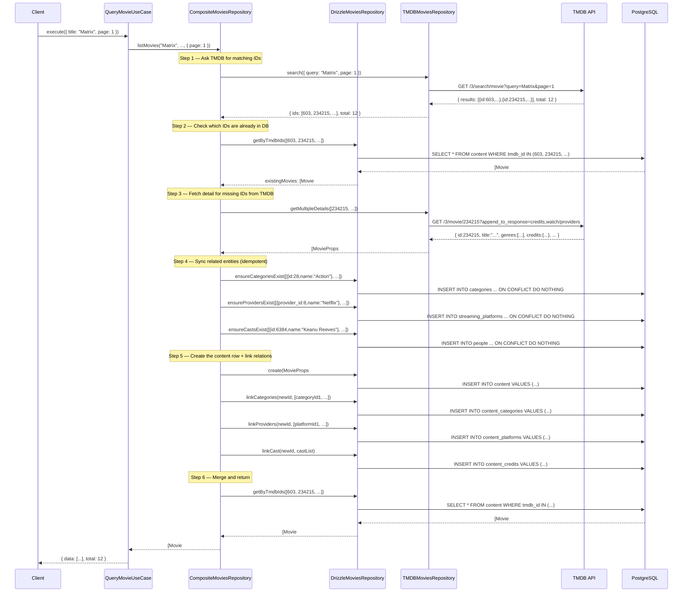
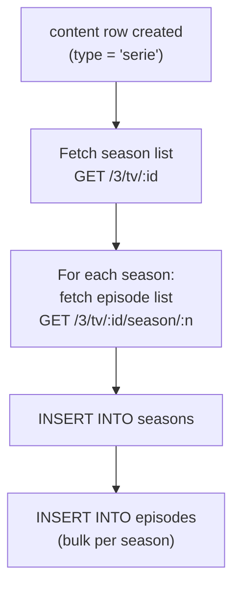

# TMDB Integration

The project fetches movie and series data on demand from [The Movie Database (TMDB)](https://www.themoviedb.org/) API and caches it in PostgreSQL. This document explains the full flow: from an incoming API request to data stored in the database and returned to the client.

---

## Why on-demand fetching?

Rather than importing TMDB's entire catalogue up front, Kirona fetches and stores content only when it is first requested. This means:
- The database starts empty and fills up organically with content users actually search for.
- A `tmdb_fetch_status` cache table prevents redundant external calls.
- The `composite repository` pattern makes this transparent to the use case layer.

---

## Architecture layers



The use case always calls the **composite repository interface** (`IMoviesRepository`). It never knows whether the data came from TMDB or the local database.

---

## Full sequence — search request



---

## Key components

### `TmdbService`

**File:** `apps/api/src/shared/services/tmdb/tmdb-service.ts`

Thin wrapper around `fetch` that adds the API key, language, and base URL. Throws `ServerError` on non-2xx responses.

```typescript
const result = await this.tmdbService.request<TMDBMovieListResult>(
  "GET",
  "3/search/movie",
  { query: "Matrix", page: "1" }
);
```

### `BaseTMDBRepository`

**File:** `apps/api/src/shared/infrastructure/repositories/base-tmdb-repository.ts`

Abstract base for both `TMDBMoviesRepository` and `TMDBSeriesRepository`. Provides:

| Method | Description |
|---|---|
| `discover(params)` | Browse content by genre (`/discover/movie` or `/discover/tv`) |
| `search(params)` | Full-text search (`/search/movie` or `/search/tv`) |
| `detail(id)` | Fetch a single item with credits and watch providers |
| `getMultipleDetails(ids)` | Parallel `Promise.all` over `detail()` |

### `BaseCompositeRepository`

**File:** `apps/api/src/shared/infrastructure/repositories/base-composite-repository.ts`

Implements the merge logic described in the sequence diagram above. Shared by both `CompositeMoviesRepository` and `CompositeSeriesRepository`.

Key private methods:

| Method | What it does |
|---|---|
| `ensureCategoriesExist(genres)` | Upserts TMDB genre → `categories` row; caches ID in memory |
| `ensureProvidersExist(providers)` | Upserts streaming provider → `streaming_platforms` row |
| `ensureCastsExist(cast)` | Upserts cast member → `people` row |
| `ensureSeasonsExist(series, seasons)` | Creates `seasons` + `episodes` rows for series |
| `createEntitiesWithRelations(props[])` | Orchestrates the above, then creates `content` rows and junction table entries |

### `CompositeMoviesRepository` / `CompositeSeriesRepository`

Concrete implementations that extend `BaseCompositeRepository` and implement the domain interface (`IMoviesRepository` / `ISeriesRepository`). They expose the same methods the use case calls (`listMovies`, `searchMovies`, `getMovieById`).

---

## `tmdb_fetch_status` cache table

To avoid hitting the TMDB rate limit on repeated identical requests, the system stores fetch results with an expiry:

```sql
tmdb_fetch_status {
    path       varchar UNIQUE  -- e.g. "search/movie?query=Matrix&page=1"
    type       varchar         -- "search" | "discover"
    metadata   jsonb           -- raw TMDB response
    expires_at timestamp
}
```

The `remove_expired` constraint filters out stale entries. A lookup checks this table before making the HTTP call.

---

## Series-specific flow: seasons and episodes

Series have an additional sync step. After creating the `content` row:



Episode bulk inserts are batched to avoid generating hundreds of individual queries for a series with many seasons.

---

## Adding support for a new content type

If you ever need to add a third content type (e.g. documentaries as a separate entity):

1. Create `TMDBDocumentaryRepository` extending `BaseTMDBRepository`
2. Create `DrizzleDocumentaryRepository` with the Drizzle schema
3. Create `CompositeDocumentaryRepository` extending `BaseCompositeRepository`
4. Create `IDocumentaryRepository` in the domain layer
5. Wire it in a new `documentaries` module

The composite base handles all the category/platform/cast sync logic — you only need to override what is specific to the new type.

---

## Environment variable

| Variable | Where it is used |
|---|---|
| `TMDB_API_KEY` | `TmdbService` constructor, via `config.env.externalApi.tmdbApiKey` |

If `TMDB_API_KEY` is missing, `TmdbService.request()` returns a 401 from TMDB and throws `ServerError`. Content search endpoints will fail until the key is set.
