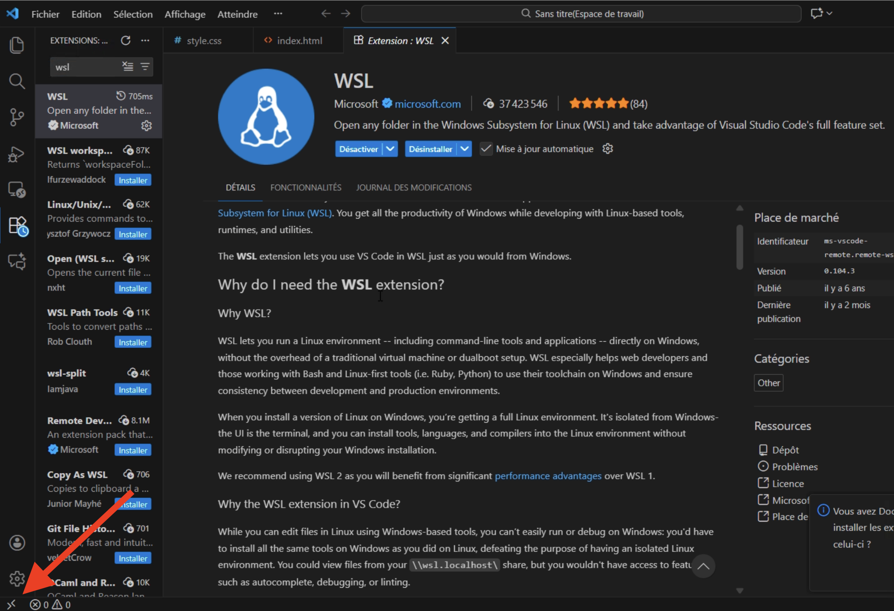

# WSL for vscode

## Prerequisites 

You need [Visual Studio Code](https://code.visualstudio.com/) installed.

### Install the extension 

The WSL extension enables you to run Visual Studio Code within the Windows Subsystem for Linux (WSL).

<a href="vscode:extension/ms-vscode-remote.remote-wsl" class="button primary">Install the WSL extension</a>

### Prerequisite check 

With the WSL extension installed, you will see a new Status bar item at the far left.

## Connect to the WSL environment




### Click on the icon extension

<figure><figcaption></figcaption></figure>




### Use distro to open WSL

<figure><figcaption></figcaption></figure>




### Connect the right environment


You may have multiple environment.

The most common is <mark style="color:blue;">**"Debian"**</mark>




## Open a folder and start coding




### Choose your folder

#### Click on the button "Open folder"

<figure><figcaption></figcaption></figure>

#### Choose your folder

<figure><figcaption></figcaption></figure>

#### Click "OK"

<figure><figcaption></figcaption></figure>




### HAPPY HACKING



